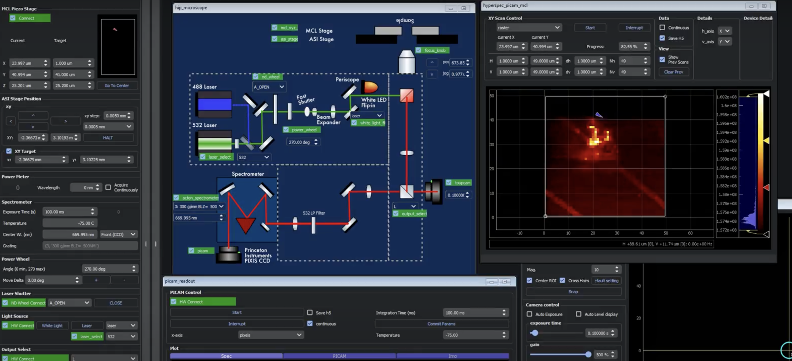

[getting_started_docs]:/docs/1_getting-started/
[tools_tutorials]:/docs/11_tools-tutorials/



<a class="btn btn-lg btn-primary me-3 mb-4" href="docs/">Create your App now <i class="fas fa-arrow-alt-circle-right ms-2"></i>
</a>

<a class="btn btn-lg btn-secondary me-3 mb-4" href="docs/30_tips-and-tricks/analyze-with-ipynb/">Open a ScopeFoundry .h5 file <i class="fas fa-arrow-alt-circle-right ms-2"></i>
</a>

A Python platform for controlling custom laboratory experiments and visualizing scientific data.



{}
{}
Design lab equipment GUIs interactively with Qt Creator, allowing for fast data acquisition and visualization. 
{}

{}
Or make your own based on templates!{}

{}
Live updates of measurement code for fast development and debugging.
{}

{}

{}

{}

{}
## Interactive User Interface

	<iframe width="600" height="400" src="//www.youtube.com/embed/GJRVbZ8zYVY" frameborder="0" allowfullscreen></iframe>

{}

{}
## IPython interactive data access

  <iframe width="600" height="400" src="//www.youtube.com/embed/BdwPL2iOmns" frameborder="0" allowfullscreen></iframe>

{}

{}
## Live code update in Eclipse/PyDev

	<iframe width="600" height="400" src="//www.youtube.com/embed/kd8OitLPXcM" frameborder="0" allowfullscreen></iframe>

{}

{}
## 4D-STEM interactive data explorer

	<iframe width="600" height="400" src="//www.youtube.com/embed/XJaCfdVUQw0" frameborder="0" allowfullscreen></iframe>

{}

{}

## Uses

* Currently used in multi-modal scanning microscopy measurements with electrons and optics.
* Flexible for many other data acquisition tasks.

{}

{}

{}
We do a [Pull Request](https://github.com/ScopeFoundry/ScopeFoundry/pulls) contributions workflow on **GitHub**. New users are always welcome!
{}

{}
For posting questions and announcements of latest features.
{}

{}
{}

{}

