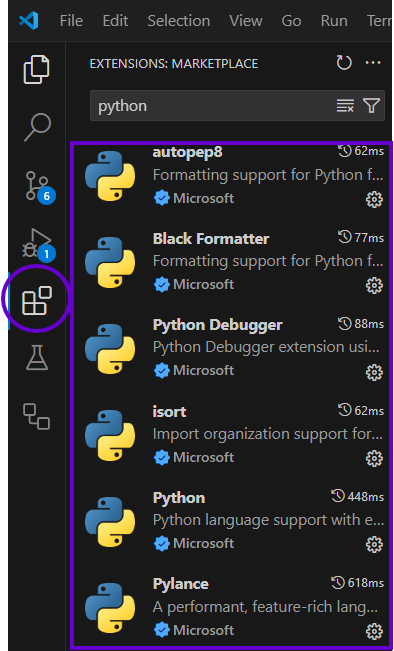
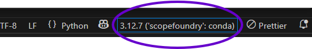
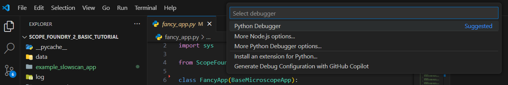

[anaconda_dl]: https://www.continuum.io/downloads
[Eclipse]: http://www.eclipse.org
[PyDev]: http://www.pydev.org
[conda_env]: http://conda.pydata.org/docs/using/envs.html
[install ScopeFoundry]: /docs/1_getting-started/
[Qt Creator]: https://www.qt.io/offline-installers

This guide explains the steps to set up VS Code after installing the Anaconda environment `scopefoundry`, as described [here][install ScopeFoundry].

### Steps to Set Up VS Code

1. **Install [Visual Studio Code](https://code.visualstudio.com/download).**

2. **Install Extensions:**
   1. Python (Microsoft)  
   2. Pylance (Microsoft)          
      *Optional, but recommended:*
       - Jupyter (Microsoft) 
       - [h5web](https://marketplace.visualstudio.com/items?itemName=h5web.vscode-h5web)
      
       - see picture.

      

3. **File -> Open Folder...** to open `your_project_folder`.

4. **Select the Python Interpreter:**

   - Open the Command Palette (`Ctrl+Shift+P` or `Cmd+Shift+P` on macOS).
   - Search for and select **"Python: Select Interpreter"**.
   - Choose the interpreter associated with the `scopefoundry` environment.

   *or*

   - select on the bottom right: 

      

5. **Run a Python File (e.g., `fancy_app.py`):**
   1. Open and select the file you want to run, such as `fancy_app.py`.
   2. Press `F5` or go to **Run > Start Debugging**.
   3. If prompted:
      - Select **Python Debugger**.  
        
      - Select **Python File**.
      - Press the blue button labeled **"Debug and Run"**.

6. **Verify the App Runs:**
   - The app should now execute successfully.

## Next 

Install [Git](../20_git).