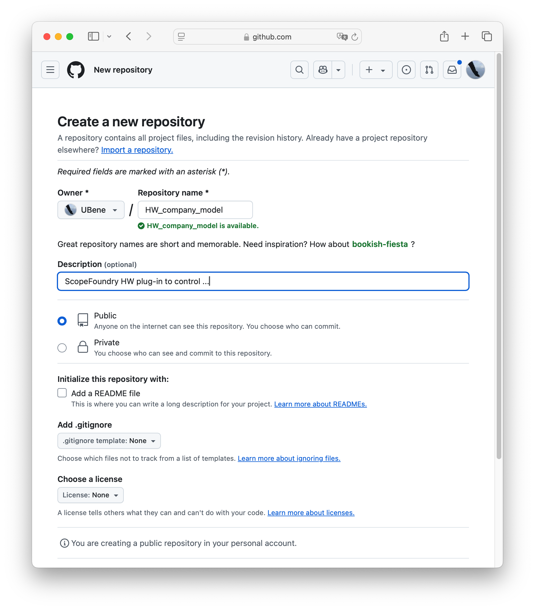

The following instructions publish   `company_model`  in your_project_folder's `ScopeFoundryHW` 

```
├── your_project_folder
    ├── ScopeFoundryHW
     	├── company_model
     		├── company_model_hw.py					
     		├── Licence
     		├── README.md
     		# optional
     		├── company_model_dev.py			
     		├── company_model_test_app.py
     		├── ** more files/directory that make your hw component work
     **
```

If you like to adhere to this [template use ScopeFoundry.tools](/docs/11_tools-tutorials/2_hardware-1/#the-template) 

## Publish your hardware

1. Create the target repo on GitHub by prepending `HW_` to the package

   1. sign-up/log-on on GitHub with your `USER_NAME` 
   2. New (repository) to make a public repo named `HW_{company_model}`
      
      3. note the repo url for the next step

2. Initialize git repositiory localy 

   ```sh
   cd ScopeFoundryHW/{company_model}
   git init --initial-branch=main
   ```

3. Commit your code. If it is the first commit, we can commit all at once 

   ```sh
   git add -A && git commit -m "Initial release"
   ```

4. Push your code to the remote repo

   ```sh
   git remote add origin https://github.com/{USER_NAME}/HW_{company_model}.git
   git push origin
   ```

#### Discoverable on this page

This page periodically crawls GitHub for HW_* repos. Thereby, it considers users/organisations that forked the ScopeFoundry Repo. So this page will find your hw repo if 

- you fork [ScopeFoundry/Scopefoundry](https://github.com/ScopeFoundry/ScopeFoundry)
- Indeed label your Hardware repo starting with `HW_`


## Updating to already published plug-ins

If it is **not** your repo or you do **not** have write access:

- Sign up/log on github with your  `USER_NAME`
- fork the original repo

Now you should have github repository url of the form: `https://github.com/{USER_NAME}/HW_{company_model}.git`  Here we push to the branch `master`.

1. go the folder you of the hardware
   ```sh
   cd to/your_project_folder/ScopeFoundryHW/{company_model}
   ```

2. Commit your code. To wrap all changes in one commit (not necessarily recommended)
   ```sh
   git add -A && git commit -m "describe your contribution"
   ```

4. Push your code to the remote repo
   ```sh
   git remote add origin https://github.com/{USER_NAME}/HW_{company_model}.git
   git push origin
   ```


If you'd like to share your updates with the original owner then create a Pull Request on GitHub.


## Adding published plug-ins to your project

Assuming:

- urls `https://github.com/{USER_NAME}/{company_model}.git`
- with branch `master`

```sh
mkdir ScopeFoundryHW/{company_model} && cd ScopeFoundryHW/{company_model} && git init --initial-branch=master && git remote add upstream https://github.com/{USER_NAME}/{company_model}.git && git pull upstream master && cd ../..
```

HINT: The entries of [reference/hw-components](/docs/300_reference/hw-components/) all ready contain this line other update and run it from your Project folder
