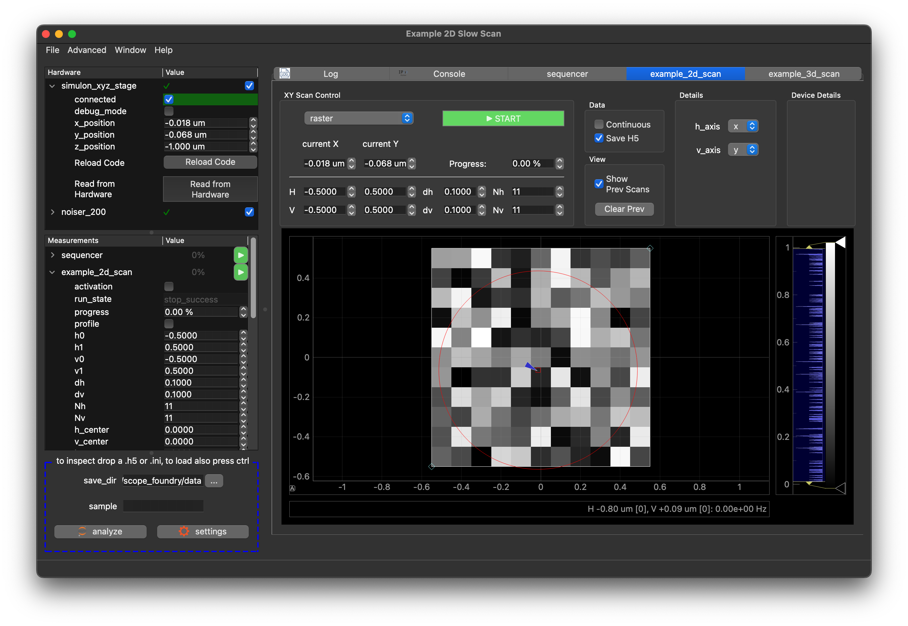

## Getting started with ScopeFoundry 2.0

Note

### Step 1: Installing Python and ScopeFoundry

[anaconda_dl]: https://www.anaconda.com/download/success

Note: We recommend the [Anaconda](https://www.anaconda.com/download/success) Python distribution, which contains many easy-to-install scientific python packages.

* Download and Install [Anaconda](https://www.anaconda.com/download/success). The recommended Python version is 3.12, If you already had a non-Anaconda version of python installed, you will need to make sure you use Anaconda if you would like to follow the instructions below.

* Anaconda provides a way to make a clean set of packages in an "environment". Follow these steps to create an [conda environment](http://conda.pydata.org/docs/using/envs.html). This environment includes ScopeFoundry and all of the packages ScopeFoundry needs to run. 

__Windows__
    
Open an Anaconda prompt and run the following commands:

```sh
> conda create -n scopefoundry python=3.12
> conda activate scopefoundry
(scopefoundry) > conda install numpy pyqt qtpy h5py pyqtgraph pyserial matplotlib qtconsole
(scopefoundry) > pip install ScopeFoundry
```
The first two lines create and activate a clean python / conda environment for your ScopeFoundry app to use, the next lines install the required packages and the final line install the ScopeFoundry package itself.    

The use of the conda environment is optional, but provides a clean, known working environment for ScopeFoundry

__Mac / Linux__

Open a terminal and run the following commands:

```sh
$ conda create -n scopefoundry python=3.12
$ source activate scopefoundry
(scopefoundry) $ conda install numpy pyqt qtpy h5py pyqtgraph
(scopefoundry) $ pip install ScopeFoundry
```

The first two lines create and activate a clean python / conda environment for your ScopeFoundry app to use, the next lines install the required packages and the final line install the ScopeFoundry package itself. 

Note in the following instead of terminal the phrase anaconda prompt will be used.


### Step 2: Create your Microscope App

After installation, use anaconda prompt and navigate to where you want or have the source code for your setup and start scopefoundry tools:

```sh
$ cd "to/your_project_folder"
$ conda activate scopefoundry
$ python -m ScopeFoundry.tools
```

Go to the new microscope tab define your name and hit create. This copied the scope foundry example files to your project folder. In your anaconda(3) prompt run:

```sh
$ python example_slowscan_app.py
```

you should see:



### Step 3: try to understand

Now is a good time to learn the bare minimum of ScopeFoundry. On the left panel you see a 2 lists.  

1. Hardware: are made of `HardwareComponent` who job it is to establish a connection to your hardware, readout and set values. 

2. Measurements: are made of `Measurement` classes that define the procedures of aquiring and saving data. They can have graphical user interfaces shown on the right. Can you start the example_2d_scan?

Note that you can expand the the item in either list to expose `settings` that can be linked to the state of the hardware and parameterize you measurements respectively.

The folder structure should be of this form: 


```sh
├── your_project_folder
    ├── ScopeFoundryHW
     	├── company1_model1
     		├── company1_model1_hw.py					
     		├── company1_model1_dev.py			
     		├── company1_model1_test_app.py
     		├── **
     	**
    ├── fancy_app.py
    ├── your_measurement_1.py
    ├── **
```

In particular the folder contains:

1. A subfolder `ScopeFoundryHW` containing hardware control code. There must be at least a file, typically ending with `_hw.py`, that contains a subclass of type `HardwareComponent`.
2. measurement files containing `Measurement` subclasses.
3. The actual app file where `Measurement` und `HardwareComponent` are added to the main app. That is the file that gets run.

Congratulations, you have created your first microscope and saw the 3 most prutent high level concepts. `HardwareComponent` and `Measurement` can each have `settings`.


## Next Steps

Now that you have interacted with ScopeFoundry and built a microscope app with pre-built components, you probably would like to build a system that allows you to do real scientific experiements. To do this have a look at tutorials on how to build

1.	a custom [Hardware Component](../2-hardware-1)
2. 	a custom [Measurement](../3-measurement)
3.  a custom [Data Browser Viewer]((5_data-browser-viewer)) for your data files

