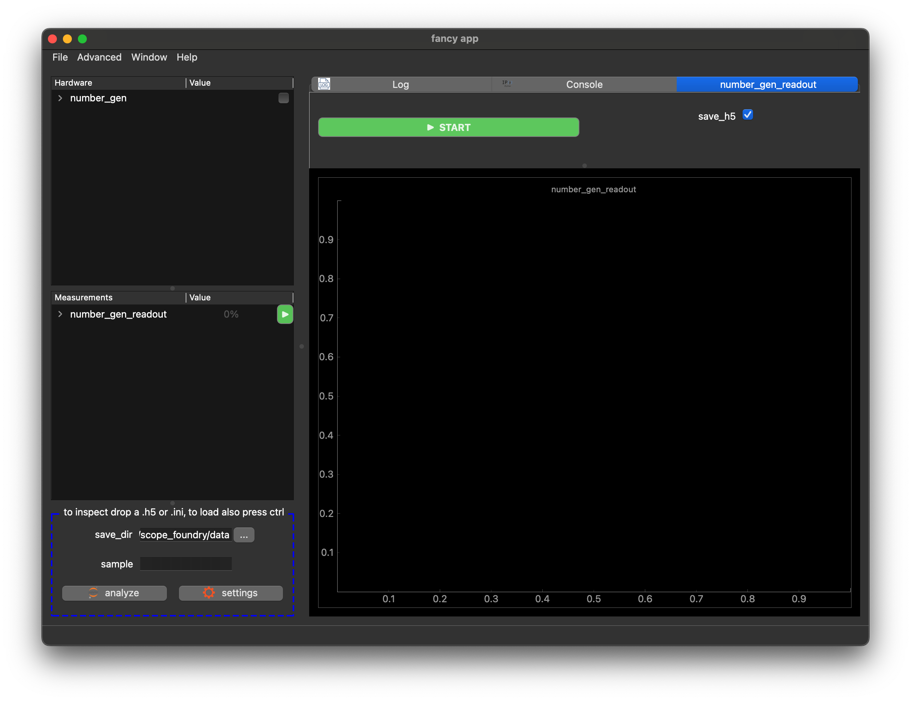

Here we discuss how to build a custom hardware plug-in for ScopeFoundry. If one is not [available in our list of plug-ins](/docs/300_reference/hw-components), you can build one based on this tutorial. 

Hardware - 1 goals:

- learn basic ScopeFoundry concepts of ScopeFoundry.HardwareComponent
- created a plugin - virtual sine wave generator, virtual because we just simulate values 

Hardware - 2 goals:

- Tipps to create the low level interface that connects to an actual device


## The template

To get started, in your anaconda prompt or terminal cd to your folder and run the ScopeFoundry.tools:

```sh
# cd "to/your_project_folder"
conda activate scopefoundry
```

```sh
python -m ScopeFoundry.tools
```


Fill out the `new hardware` tab as below and hit `create new hardware`:


Note, that this generated the required files in your `ScopeFoundryHW` folder. You can copy the content of import statements into your `fancy_app.py` file (that you already have generated in a [prev tutorial](../1_new-microscope-app) renamed from `example_2d_slow_scan_app.py` to `fancy_app.py`). If you used the values entered above your `fancy_app.py` should look like:

```python
# fancy_app.py
import sys

from ScopeFoundry import BaseMicroscopeApp


class FancyApp(BaseMicroscopeApp):

    name = "fancy app"

    def setup(self):

        from ScopeFoundryHW.random_number_gen import (NumberGenHw,
                                                      NumberGenReadout)
        self.add_hardware(NumberGenHw(self))
        self.add_measurement(NumberGenReadout(self))

if __name__ == "__main__":
    app = FancyApp(sys.argv)
    # app.settings_load_ini("default_se ttings.ini")
    sys.exit(app.exec_())

```

From here, in general, 2 files in `ScopeFoundryHW/random_number_gen` are important and will be modified to complete part 1:

## Low level interface: number_gen_dev.py

In general, this file functions as a low-level interface between ScopeFoundry and a process or demon running on the operating system that communicates with the hardware. For now, this file will be just given, and simulates a sine wave function generator. In [part 2](../10_hardware-2) we give some tips on how to write this in practice.

Go ahead and replace the content of `random_gen_dev.dev` with the following content

```python
# number_gen_dev.py
import time

import numpy as np

class NumberGenDev:

    """
    This is the low level dummy device object.
    Typically when instantiated it will connect to the real-world
    Methods allow for device read and write functions
    """
        
    def __init__(self, port=None, debug=False):
        """We would connect to the real-world here
        if this were a real device
        """
        self.port = port
        self.debug = debug
        print("NumberGenDev: Connecting to port", port)
        self.write_amp(1)

    
    def write_amp(self, amplitude):
        """
        A write function to change the device's amplitude
        normally this would talk to the real-world to change
        a setting on the device
        """
        self._amplitude = amplitude
            
    def read_rand_num(self):
        """
        Read function to access a Random number generator. 
        Acts as our scientific device picking up a lot of noise.
        """
        rand_data = np.random.ranf() * self._amplitude
        return rand_data
    
    def read_sine_wave(self):
        """
        Read function to access a sine wave.
        Acts like the device is generating a 1Hz sine wave
        with an amplitude set by write_amp
        """
        sine_data = np.sin(time.time()) * self._amplitude
        return sine_data

if __name__ == '__main__':
    print('start')
    dev = NumberGenDev(port="COM1", debug=True)
    print(dev.read_sine_wave())
    print('done')

```

##### Some comments:

When we create an instance of this device class, we begin communication with the device. Other methods with names starting with `read_` or `write_` are the messages we can pass back and forth to the device.

In this case, we defined a method `read_rand_num` which uses a random number generator from numpy and returns a random value every time it's called. This function is referenced in the hardware plugin section below code.

In the case where you would like to connect to real scientific equipment and define basic functions based on its communication protocol, I would recommend the following:

- Define whichever addresses and ports you would like to use using variables defined in the module's `__init__()` method.
- Then define a write function which can send messages to the device over RS232, Ethernet, via DLL or other protocol as required.


## The actual ScopeFoundry Hardware plug-in

The next step is to create a subclass `ScopeFoundry.hardware.HardwareComponent` that will be added to the app. 

The required methods are: `setup()`, `connect()`, and `disconnect()`.

```python
# number_gen_hw.py
from ScopeFoundry.hardware import HardwareComponent


class NumberGenHw(HardwareComponent):

    name = "number_gen"

    def setup(self):
        s = self.settings
        s.New("port", str, initial="COM1", description="has no effect for this dummy device")
        s.New("amplitude", float, initial=1.0, ro=False)
        s.New("rand_data", float, initial=0, ro=True)
        s.New("sine_data", float, initial=0, ro=True)

    def connect(self):
        from .number_gen_dev import NumberGenDev

        s = self.settings
        self.dev = NumberGenDev(s["port"], debug=s["debug_mode"])

        # Connect settings to hardware:
        s.get_lq("amplitude").connect_to_hardware(write_func=self.dev.write_amp)
        s.get_lq("rand_data").connect_to_hardware(read_func=self.dev.read_rand_num)
        s.get_lq("sine_data").connect_to_hardware(read_func=self.dev.read_sine_wave)

        # Take an initial sample of the data.
        self.read_from_hardware()

    def disconnect(self):
        if not hasattr(self, "dev"):
            return

        self.settings.disconnect_all_from_hardware()
        del self.dev

    # if you want to continuously update settings implement *run* method
    # def run(self):
    #     self.settings.property_x.read_from_hardware()
    #     time.sleep(0.1)

```

There are several critical components contained within this module which essentially handle signals, settings, and links to low-level device functions. 

For the sake of simplicity, we've omitted hardware level signals in this basic tutorial.

- `class`: We make our module a _subclass_ of `HardwareComponent`.
	- `setup()`
		- Here we set up a few settings for this hardware, these settings are `LoggedQuantity` objects that contain a hardware value that can be read or written. This object helps keep this value in sync between hardware, measurement and graphical interface.

	- `connect()`
		- We define an object `self.dev` which instantiates the low-level device wrapper and thereby accesses hardware functions.
		- Using `connect_to_hardware()` we link to the device level `self.dev.rand_func`. Every time we call `settings.get_lq("rand_data").read_from_hardware()`, the linked functions will be called.
		- We run `self.read_from_hardware()` to update all hardware-connected settings with initial readout values.

	- `disconnect()`
		- We clean up the mess we made by removing objects after use.

By having the `connect()` and `disconnect()` we can cleanly reconnect hardware during an App run. This is especially useful when debugging a hardware plug-in to a new device. 


## The final result

Test by running:

```shell
python fancy_app.py
```

You should see:



Note that we have implicitly created and added a measurement to the app. It is not working yet, this will be part of the [next tutorial](../3_measurement).
