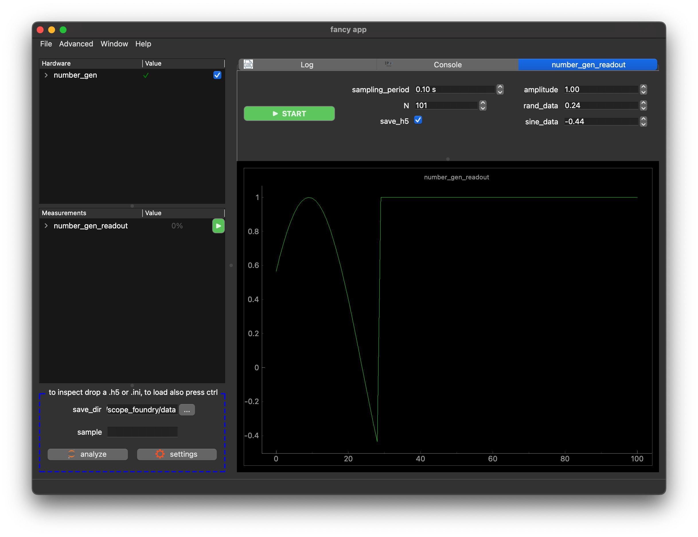
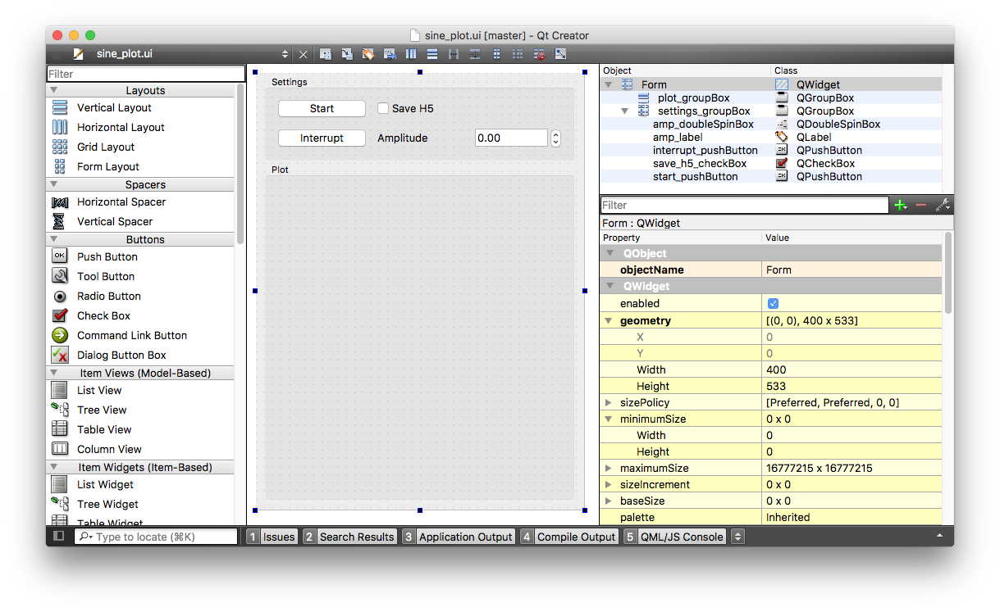
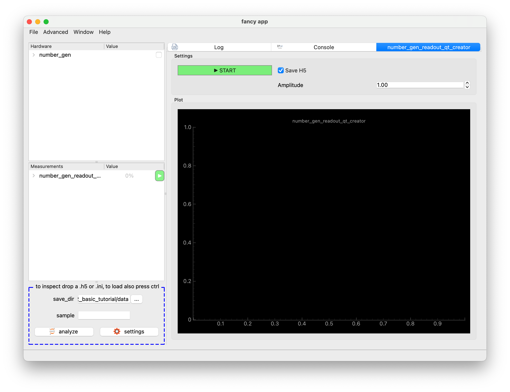

[ Qt Creator ]:https://www.qt.io/offline-installers
[analyze with jupyter notebook]:/docs/30_tips_and_tricks/analyze-with-ipynb/
[getting_started_docs]:/docs/1_getting-started/
[more on hardware]:../10_hardware-2/


We will be describing how to build the `number_gen_readout` measurement that works together with ScopeFoundryHW package we made in the [previous tutorial](../2_hardware-1). When run, this measurement periodically samples values from the `number_gen` hardware component.

## Essential components

A ScopeFoundry Measurement is defined as a sub-class of `ScopeFoundry.Measurement` and has a `name`:

``` python
import time

import numpy as np

from ScopeFoundry import Measurement, h5_io

class NumberGenReadoutSimple(Measurement):

    name = "number_gen_readout_simple"
```

Then we override `setup()` and `run()` functions that define the measurement. Starting with:

```python
    def setup(self):
        """
        Runs once during App initialization.
        This is the place to load a user interface file,
        define settings, and set up data structures.
        """

        s = self.settings
        s.New("sampling_period", float, initial=0.1, unit="s")
        s.New("N", int, initial=101)
        s.New("save_h5", bool, initial=True)
```

To define 3 parameters that will be used during the measurement. 

When a measurement is started, a new thread is launched, within which eventually the `run()` function is called, let's override it to 

1. sample values from the "number_gen" hardware component 

```python
    def run(self):
        """
        Runs when measurement is started. Runs in a separate thread from GUI.
        It should not update the graphical interface directly, and should only
        focus on data acquisition.
        """
      	# prepare an array for data in memory.
        self.data = np.ones(self.settings["N"])
        
        # get a reference to the hardware
        self.hw = self.app.hardware["number_gen"]
        
        # N-times sampling the hardware for values
        for i in range(self.settings["N"]):
          self.data[i] = self.hw.settings.sine_data.read_from_hardware()
          time.sleep(self.settings["sampling_period"])
          self.set_progress(i * 100.0 / self.settings["N"])
          if self.interrupt_measurement_called:
            break
```

-  `interrupt_measurement_called` flag is set to True when the user stops the measurement. Here it breaks out the loop as the measurement spends most of its time there
- Using `set_progress()` update the progress bar and also calculates an estimated time until the measurement is done based on the time it started and the progress percentage you set.

2. save it to a h5 file (if user desires). With this boilerplate code all settings from every hardware and the measurement are saved.

```python
        if self.settings["save_h5"]:
            # open a file
            self.h5_file = h5_io.h5_base_file(app=self.app, measurement=self)

            # create a measurement H5 group (folder) within self.h5file
            # This stores all the measurement meta-data in this group
            self.h5_group = h5_io.h5_create_measurement_group(
                measurement=self, h5group=self.h5_file
            )

            # dump the data set and close the file.
            self.h5_group.create_dataset(name="y", data=self.data)
            self.h5_file.close()
```

#### The case for using self.settings

- When saving data as written above, the values are added to the resulting file which is useful
  - To analyze data
  - User can drag and drop the file on the app to reload the value and bring ScopeFoundry to the same state
- ScopeFoundry already generates widgets in the tree left that user can use to set values
- Coherent way to access settings in other components. For example, here we referenced a setting from the "number_gen" hardware component, asked it to update itself and retrieved a value
- Easy way to generate GUI and connect to widget in GUIs as you will see next


## Adding a graphical user interface

 We use two Qt based libraries to create the UI, let's import them on top of the file.

```python
import pyqtgraph as pg
from qtpy import QtCore, QtWidgets
```

The GUI should be created at start-up, hence override the `setup_figure` function (that gets called after the `setup` function). ScopeFoundry expects that `setup_figure` defines `self.ui` with a widget. 

Here we define the GUI programmatically, alternatively one can use Qt-Creator, see below):

```python
    def setup_figure(self):
        self.ui = QtWidgets.QWidget()
```

`QtWidgets.QWidget()` is an empty widget.

To add widget onto `self.ui` one must a layout. (In Qt world one cannot add widget directly on a widget)

```python
        layout = QtWidgets.QVBoxLayout()
        self.ui.setLayout(layout)
```

The type of layout defines how added widgets are arranged. Here, `QVBoxLayout` stacks them vertically. ScopeFoundry provides convenience methods to create widgets that out of the box update when `settings` values change and conversely change the `settings` value when its corresponding widget is changed. Let's add widgets for the settings defined in the `setup` function and a start/stop button to the layout

```python
        layout.addWidget(self.settings.New_UI(include=("sampling_period", "N", "save_h5")))
        layout.addWidget(self.new_start_stop_button())
```

Finally let's add the plot widget, with axes and a line:

```python
        self.graphics_widget = pg.GraphicsLayoutWidget(border=(100, 100, 100))
        self.plot = self.graphics_widget.addPlot(title=self.name)
        self.plot_lines = {}
        self.plot_lines["y"] = self.plot.plot(pen="g")
        layout.addWidget(self.graphics_widget)
```

ScopeFoundry calls `update_display()` repeatedly during a measurement. Let's override it:

```python
    def update_display(self):
        self.plot_lines["y"].setData(self.data["y"])
```

Note you do not have to call `update_display` yourself, you can control the frequency it gets called with `self.display_update_period` attribute.


## Putting everything together

We place a `number_gen_readout_simple.py` next to the `fancy_app.py`.

```python
# number_gen_readout_simple.py
import time

import numpy as np
import pyqtgraph as pg
from qtpy import QtCore, QtWidgets

from ScopeFoundry import Measurement, h5_io


class NumberGenReadoutSimple(Measurement):

    name = "number_gen_readout_simple"

    def setup(self):
        """
        Runs once during App initialization.
        This is the place to load a user interface file,
        define settings, and set up data structures.
        """

        s = self.settings
        s.New("sampling_period", float, initial=0.1, unit="s")
        s.New("N", int, initial=101)
        s.New("save_h5", bool, initial=True)

    def run(self):
        """
        Runs when measurement is started. Runs in a separate thread from GUI.
        It should not update the graphical interface directly, and should only
        focus on data acquisition.
        """

      	# prepare an array for data in memory.
        self.data = np.ones(self.settings["N"])
        
        # get a reference to the hardware
        self.hw = self.app.hardware["number_gen"]
        
        # N-times sampling the hardware for values
        for i in range(self.settings["N"]):
          self.data[i] = self.hw.settings.sine_data.read_from_hardware()
          time.sleep(self.settings["sampling_period"])
          self.set_progress(i * 100.0 / self.settings["N"])
          if self.interrupt_measurement_called:
            break
                        
        if self.settings["save_h5"]:
            # open a file
            self.h5_file = h5_io.h5_base_file(app=self.app, measurement=self)

            # create a measurement H5 group (folder) within self.h5file
            # This stores all the measurement meta-data in this group
            self.h5_group = h5_io.h5_create_measurement_group(
                measurement=self, h5group=self.h5_file
            )

            # dump the data set and close the file
            self.h5_group.create_dataset(name="y", data=self.data)
            self.h5_file.close()
        
    def setup_figure(self):
        """
        Runs once during App initialization and is responsible
        to create widget self.ui.        
        """
        self.ui = QtWidgets.QWidget()

        layout = QtWidgets.QVBoxLayout()
        self.ui.setLayout(layout)
        layout.addWidget(self.settings.New_UI(include=("sampling_period", "N", "save_h5")))
        layout.addWidget(self.new_start_stop_button())
        self.graphics_widget = pg.GraphicsLayoutWidget(border=(100, 100, 100))
        self.plot = self.graphics_widget.addPlot(title=self.name)
        self.plot_lines = {"y": self.plot.plot(pen="g")}
        layout.addWidget(self.graphics_widget)

    def update_display(self):
        self.plot_lines["y"].setData(self.data)
```

We add this Measurement to the app using `add_measurement()` method:

```python
# fancy_app.py
import sys

from ScopeFoundry import BaseMicroscopeApp

class FancyApp(BaseMicroscopeApp):

    name = "fancy app"

    def setup(self):

        from ScopeFoundryHW.random_number_gen import NumberGenHw
        self.add_hardware(NumberGenHw(self))

        from number_gen_readout_simple import NumberGenReadoutSimple
        self.add_measurement(NumberGenReadoutSimple(self))

if __name__ == "__main__":
    app = FancyApp(sys.argv)
    # app.settings_load_ini("default_settings.ini")
    sys.exit(app.exec_())
```

As usual this can be run with:

```sh
python fancy_app.py
```



*screenshot of improved version - see bellow*

**Next**

- [more on hardware]
- [analyze with jupyter notebook]


## Bonus: Build the user interface with qt-creator

In the above implementation we created the figure programmatically. However, we could also create use the qt creator to design a user interface.  

1. Download the free [Qt Creator]
2. Create `.ui` file. The one used here, `number_gen_readout.ui`, can be found in the [tutorial repository](https://github.com/UBene/scope_foundry_2_basic_tutorial). 
3. Save the `ui` file next to the measurement file (sibling path)
4. Adjust the `setup_figure()` method of the measurement

```python
    def setup_figure(self):
        """
        Runs once during App initialization, after setup()
        This is the place to make all graphical interface initializations,
        build plots, etc.
        """
        self.ui_filename = sibling_path(__file__, "number_gen_readout.ui")
        self.ui = load_qt_ui_file(self.ui_filename)

        # connect ui widgets to measurement/hardware settings or functions
        self.settings.activation.connect_to_pushButton(self.ui.start_pushButton)
        self.settings.save_h5.connect_to_widget(self.ui.save_h5_checkBox)
        self.hw.settings.amplitude.connect_to_widget(self.ui.amp_doubleSpinBox)
        
        # Set up pyqtgraph graph_layout in the UI
        self.graph_layout=pg.GraphicsLayoutWidget()
        self.ui.plot_groupBox.layout().addWidget(self.graph_layout)

        # Create PlotItem object (a set of axes)  
        self.plot = self.graph_layout.addPlot(title=self.name)
        # Create PlotDataItem object ( a scatter plot on the axes )
        self.plot_lines = {"y": self.plot.plot(pen="g")}
```

The resulting app should look like:




## Bonus 2: Improved version

In the above example kept things simple. We made some modifications in this final version that has the following improvements:

1. `run` 
   1. Measurement runs indefinitely or until the user hits stop
   2. Data is dumped to the file during the measurement ensuring that data is stored if the program crashes
2.  `setup_figure` 
   1. Uses splitter instead of `QVBoxLayout`
   2. Includes settings from the `hw`


```python
# number_gen_readout.py
import time

import numpy as np
import pyqtgraph as pg
from qtpy import QtCore, QtWidgets

from ScopeFoundry import Measurement, h5_io


class NumberGenReadout(Measurement):

    name = "number_gen_readout"

    def setup(self):
        """
        Runs once during App initialization.
        This is the place to load a user interface file,
        define settings, and set up data structures.
        """

        s = self.settings
        s.New("sampling_period", float, initial=0.1, unit="s")
        s.New("N", int, initial=101)
        s.New("save_h5", bool, initial=True)

        # data structure of the measurement
        self.data = {"y": np.ones(101)}
        
        # link to previous functions
        self.hw = self.app.hardware["number_gen"]

    def setup_figure(self):
        """
        Runs once during App initialization and is responsible
        to create widget self.ui.        
        
        here we create the ui figure programmatically, for an alternative using qt 
        creator see bellow.
        """

        # make a layout that holds all measurement controlls and settings from hardware
        cb_layout = QtWidgets.QHBoxLayout()
        cb_layout.addWidget(self.new_start_stop_button())
        cb_layout.addWidget(
            self.settings.New_UI(
                exclude=("activation", "run_state", "profile", "progress")
            )
        )
        # add hardware settings to the layout
        cb_layout.addWidget(self.hw.settings.New_UI(exclude=("debug_mode", "connected", "port")))
        header_widget = QtWidgets.QWidget()
        header_layout = QtWidgets.QVBoxLayout(header_widget)
        header_layout.addLayout(cb_layout)

        # make a plot widget that containing a one line
        self.graphics_widget = pg.GraphicsLayoutWidget(border=(100, 100, 100))
        self.plot = self.graphics_widget.addPlot(title=self.name)
        self.plot_lines = {}
        self.plot_lines["y"] = self.plot.plot(pen="g")

        # putting everything together
        # ScopeFoundry assumes .ui is the main widget:
        self.ui = QtWidgets.QSplitter(QtCore.Qt.Orientation.Vertical)
        self.ui.addWidget(header_widget)
        self.ui.addWidget(self.graphics_widget)

    def setup_h5_file(self):
        # This stores all the hardware and app meta-data in the H5 file
        self.h5file = h5_io.h5_base_file(app=self.app, measurement=self)

        # create a measurement H5 group (folder) within self.h5file
        # This stores all the measurement meta-data in this group
        self.h5_group = h5_io.h5_create_measurement_group(
            measurement=self, h5group=self.h5file
        )

        # create an h5 dataset to store the data
        dset = self.data["y"]
        self.h5_y = self.h5_group.create_dataset(
            name="y", shape=dset.shape, dtype=dset.dtype
        )

    def run(self):
        """
        Runs when measurement is started. Runs in a separate thread from GUI.
        It should not update the graphical interface directly, and should only
        focus on data acquisition.
        """

        # a buffer in memory for data
        self.data["y"] = np.ones(self.settings["N"])

        if self.settings["save_h5"]:
            self.setup_h5_file()

        # We use a try/finally block, so that if anything goes wrong during a measurement,
        # the finally block can clean things up, e.g. close the data file object.
        try:
            i = 0

            # Will run forever until interrupt is called.
            while not self.interrupt_measurement_called:
                i %= len(self.h5_y)

                # Set progress bar percentage complete
                self.set_progress(i * 100.0 / self.settings["N"])

                # Fills the buffer with sine wave readings from func_gen Hardware
                self.data["y"][i] = self.hw.settings.sine_data.read_from_hardware()

                if self.settings["save_h5"]:
                    # if we are saving data to disk, copy data to H5 dataset
                    self.h5_y[i] = self.data["y"][i]
                    # flush H5
                    self.h5file.flush()

                # wait between readings.
                # We will use our sampling_period settings to define time
                time.sleep(self.settings["sampling_period"])

                i += 1

                if self.interrupt_measurement_called:
                    # Listen for interrupt_measurement_called flag.
                    # This is critical to do, if you don't the measurement will
                    # never stop.
                    # The interrupt button is a polite request to the
                    # Measurement thread. We must periodically check for
                    # an interrupt request
                    break

        finally:
            print("NumberGenReadout: Finishing")
            if self.settings["save_h5"]:
                # make sure to close the data file
                self.h5file.close()
                
 
    def update_display(self):
    		"""
        Function is called repeatedly at an interval defined by `self.display_update_period` (in seconds). This value is set by default to 0.1 seconds, but can be updated in `setup_figure()`. 

  			Since we created all the plot objects during `setup_figure()` this `update_display()` function can be quite simple. Here we update the `self.plot_lines["y"]` using the data in `self.data['y']`, which is being filled by the Measurement `run()` thread.
    		"""
        self.plot_lines["y"].setData(self.data["y"])

```


#### Result of improved version:


**Next**

- [more on hardware]
- [analyze with jupyter notebook]

