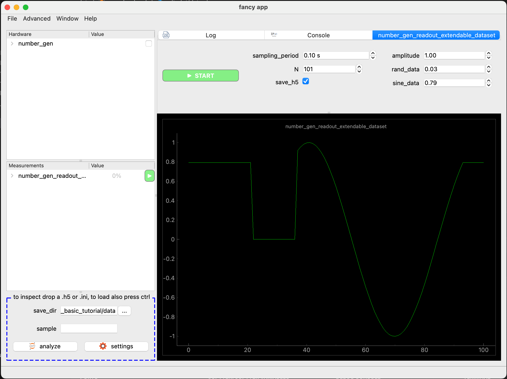

[Qt Creator]: https://www.qt.io/offline-installers
[analyze with Jupyter Notebook]: /docs/30_tips-and-tricks/analyze-with-ipynb/
[getting_started_docs]: /docs/1_getting-started/
[more on hardware]: docs/11_tools-tutorials/10_hardware-2/

{}
New in ScopeFoundry 2.1, generate a template using in `your_project_folder`: 
```bash
python -m ScopeFoundry new_mm
```
{}

This tutorial explains how to build the `number_gen_readout` measurement, which works with the ScopeFoundryHW package created in the [previous tutorial](../2_hardware-1). When executed, this measurement periodically samples values from the `number_gen` hardware component.


## Essential Components

A ScopeFoundry Measurement is defined as a subclass of `ScopeFoundry.Measurement` and has a `name`:

```python
import time

import numpy as np

from ScopeFoundry import Measurement, h5_io

class NumberGenReadoutSimple(Measurement):

    name = "number_gen_readout_simple"
```

Next, override the `setup()` and `run()` functions to define the measurement. In this example we will add three settings that will be used during the measurement.

```python
    def setup(self):
        """
        Runs once during app initialization.
        This is where you define your settings and set up data structures.
        """

        s = self.settings
        s.New("sampling_period", float, initial=0.1, unit="s")
        s.New("N", int, initial=101)
        s.New("save_h5", bool, initial=True)
        self.data["y"] = np.ones(self.settings["N"])
```

When a measurement starts, a new thread is launched, and the `run()` function is eventually called. Override this method. **First,** sample values from the `number_gen` hardware component:

  ```python
      def run(self):
          """
          Runs when the measurement starts. Executes in a separate thread from the GUI.
          It should not update the graphical interface directly and should focus only
          on data acquisition.
          """
          # Prepare an array for data in memory.
        	y = self.data["y"] = np.ones(self.settings["N"])

          # Get a reference to the hardware
          hw = self.app.hardware["number_gen"]
          

          # Sample the hardware for values N times
          for i in range(self.settings["N"]):
              
              # read data from device.
              y[i] = hw.settings.sine_data.read_from_hardware()
              
              # wait for the sampling period.
              time.sleep(self.settings["sampling_period"])
              
              self.set_progress(i * 100.0 / self.settings["N"])
              
              # break the loop if user desires.
              if self.interrupt_measurement_called:
                  break
  ```

  - The `interrupt_measurement_called` flag is set to `True` when the user interrupts  the measurement through the GUI. 
  - The `set_progress()` method updates the progress bar and calculates the estimated time remaining based on the progress percentage and the time the measurement started.

**Second,** save the data to an HDF5 file (if the user chooses). The following boilerplate code saves all settings from every hardware component and the measurement:



    {}


  ```python
        if self.settings["save_h5"]:
            # Open a file
            self.h5_meas_group = h5_io.h5_base_file(app=self.app, measurement=self)

            # Create a measurement H5 group (folder) within self.h5file
            # This stores all the measurement metadata in this group
            self.h5_meas_group = h5_io.h5_create_measurement_group(
                measurement=self, h5group=self.h5_file
            )

            # Dump the dataset and close the file.
            for name, data in self.data.items():
                self.h5_meas_group.create_dataset(name=name, data=data)

            self.h5_file.close()

  ```
  {}

  {}
  ```python

        if self.settings["save_h5"]:
            # saves data, closes file, and sets self.dataset_metadata
            self.save_h5(data=self.data)

            # Save the data to a PNG file with the same name
            import matplotlib.pyplot as plt

            plt.figure()
            plt.plot(y)
            plt.savefig(self.dataset_metadata.get_file_path(".png"))
            plt.close()
  ```
  {}


#### The Case for Using `self.settings`

- When saving data as described above, the values are added to the resulting file, which is useful for:
  - Analyzing data.
  - Reloading the values by dragging and dropping the file onto the app, restoring ScopeFoundry to the same state at a later time.
- ScopeFoundry automatically generates widgets in the left tree that users can use to set values.
- Provides a consistent way to access settings in other components. For example, here we referenced a setting from the `number_gen` hardware component, updated it, and retrieved a value.
- Offers an easy way to generate a GUI and connect to widgets in GUIs, as demonstrated next.

## Adding a Graphical User Interface

We use two Qt-based libraries to create the UI. Import them at the top of the file:

```python
import pyqtgraph as pg
from qtpy import QtCore, QtWidgets
```

The GUI should be created at startup. Override the `setup_figure` function (called after the `setup` function). ScopeFoundry expects `setup_figure` to define `self.ui` with a widget.

Here, we define the GUI programmatically (alternatively, one can use Qt Creator, as explained below):

```python
    def setup_figure(self):
        self.ui = QtWidgets.QWidget()
```

`QtWidgets.QWidget()` creates an empty widget.

To add widgets to `self.ui`, use a layout. (In Qt, widgets cannot be added directly to another widget.)

```python
        layout = QtWidgets.QVBoxLayout()
        self.ui.setLayout(layout)
```

The type of layout determines how widgets are arranged. Here, `QVBoxLayout` stacks them vertically. ScopeFoundry provides convenience methods to create widgets that automatically update when `settings` values change and vice versa. Add widgets for the settings defined in the `setup` function and a start/stop button to the layout:

```python
        layout.addWidget(self.settings.New_UI(include=("sampling_period", "N", "save_h5")))
        layout.addWidget(self.new_start_stop_button())
```

Finally, add the plot widget with axes and a line:

```python
        self.graphics_widget = pg.GraphicsLayoutWidget(border=(100, 100, 100))
        self.plot = self.graphics_widget.addPlot(title=self.name)
        self.plot_lines = {}
        self.plot_lines["y"] = self.plot.plot(pen="g")
        layout.addWidget(self.graphics_widget)
```

ScopeFoundry repeatedly calls `update_display()` during a measurement. Override it as follows:

```python

    def update_display(self):
        self.plot_lines["y"].setData(self.data["y"])

```

Note: You do not need to call `update_display` yourself. You can control how often it is called using the `self.display_update_period` attribute.

## Putting Everything Together

We place a `number_gen_readout_simple.py` file next to the `fancy_app.py`.

```python
# number_gen_readout_simple.py
import time

import numpy as np
import pyqtgraph as pg
from qtpy import QtCore, QtWidgets

from ScopeFoundry import Measurement, h5_io


class NumberGenReadoutSimple(Measurement):

    name = "number_gen_readout_simple"

    def setup(self):
        """
        Runs once during app initialization.
        This is where you define your settings and set up data structures.
        """

        s = self.settings
        s.New("sampling_period", float, initial=0.1, unit="s")
        s.New("N", int, initial=101)
        s.New("save_h5", bool, initial=True)
        self.data = {"y": np.ones(self.settings["N"])}

    def run(self):
        """
        Runs when the measurement starts. Executes in a separate thread from the GUI.
        It should not update the graphical interface directly and should focus only
        on data acquisition.
        """
        # Prepare an array for data in memory.
        y = self.data["y"] = np.ones(self.settings["N"])

        # Get a reference to the hardware
        hw = self.app.hardware["number_gen"]

        # Sample the hardware for values N times
        for i in range(self.settings["N"]):

            # Read data from the device.
            y[i] = hw.settings.get_lq("sine_data").read_from_hardware()

            # Wait for the sampling period.
            time.sleep(self.settings["sampling_period"])

            self.set_progress(i * 100.0 / self.settings["N"])

            # Break the loop if the user requests it.
            if self.interrupt_measurement_called:
                break

        if self.settings["save_h5"]:
            # Save data, close the file, and set self.dataset_metadata
            self.save_h5(data=self.data)

            # Save the data to a PNG file with the same name
            import matplotlib.pyplot as plt

            plt.figure()
            plt.plot(y)
            plt.savefig(self.dataset_metadata.get_file_path(".png"))
            plt.close()

    def setup_figure(self):
        """
        Runs once during App initialization and is responsible
        to create widget self.ui.
        Create plots, controls widgets and buttons here.
        """
        self.ui = QtWidgets.QWidget()

        layout = QtWidgets.QVBoxLayout()
        self.ui.setLayout(layout)
        layout.addWidget(
            self.settings.New_UI(include=("sampling_period", "N", "save_h5"))
        )
        layout.addWidget(self.new_start_stop_button())
        self.graphics_widget = pg.GraphicsLayoutWidget(border=(100, 100, 100))
        self.plot = self.graphics_widget.addPlot(title=self.name)
        self.plot_lines = {"y": self.plot.plot(pen="g")}
        layout.addWidget(self.graphics_widget)

    def update_display(self):
        self.plot_lines["y"].setData(self.data["y"])
```

We add this Measurement to the app using the `add_measurement()` method:

```python
# fancy_app.py
import sys

from ScopeFoundry import BaseMicroscopeApp

class FancyApp(BaseMicroscopeApp):

    name = "fancy app"

    def setup(self):
        """
        Runs once during app initialization. This is where you add hardware
        and measurements to the app.
        """

        # Add hardware
        from ScopeFoundryHW.random_number_gen import NumberGenHW
        self.add_hardware(NumberGenHW(self))

        # Add measurement
        from measurements.number_gen_readout_simple import NumberGenReadoutSimple
        self.add_measurement(NumberGenReadoutSimple(self))

if __name__ == "__main__":
    app = FancyApp(sys.argv)
    # Optionally load default settings
    # app.settings_load_ini("default_settings.ini")
    sys.exit(app.exec_())
```

To run the app, execute the following command in your terminal:

```sh
python fancy_app.py
```

When executed, the app will display a graphical interface with the measurement and hardware components integrated.


**Next Steps**

- [More on hardware]
- [Analyze with Jupyter Notebook]

---

## Bonus: Build the User Interface with Qt Creator

In the above implementation, we created the figure programmatically. However, we could also use Qt Creator to design a user interface.

1. Download the free [Qt Creator].
2. Create a `.ui` file. The one used here, `number_gen_readout.ui`, can be found in the [tutorial repository](https://github.com/UBene/scope_foundry_2_basic_tutorial).  
   
3. Save the `.ui` file next to the measurement file (sibling path).
4. Adjust the `setup_figure()` method of the measurement:

```python
    
  	def setup_figure(self):
        ui_filename = sibling_path(__file__, "number_gen_readout.ui")
        self.ui = load_qt_ui_file(ui_filename)
        self.hw = self.app.hardware["number_gen"]

        # connect ui widgets to measurement/hardware settings or functions
        self.settings.activation.connect_to_pushButton(self.ui.start_pushButton)
        self.settings.save_h5.connect_to_widget(self.ui.save_h5_checkBox)

        self.hw.settings.amplitude.connect_to_widget(self.ui.amp_doubleSpinBox)

        # Set up pyqtgraph graph_layout in the UI
        self.graph_layout = pg.GraphicsLayoutWidget()
        self.ui.plot_groupBox.layout().addWidget(self.graph_layout)

        # Create PlotItem object (a set of axes)
        self.plot = self.graph_layout.addPlot(title=self.name)
        # Create PlotDataItem object ( a scatter plot on the axes )
        self.plot_lines = {"y": self.plot.plot(pen="g")}

```

The resulting app should look like this:


---

## Bonus 2: Extendable Dataset

In the above example, we kept things simple. We made some modifications in this final version that has the following improvements:

1. **`run()`**:
   - The measurement runs indefinitely or until the user hits STOP.
   - Data is dumped to the file during the measurement, ensuring that data is stored even if the program crashes. 
   - Since we do not know the dataset length beforehand, we made it extendable.
2. **`setup_figure()`**:
   - Uses a splitter instead of `QVBoxLayout`.
   - Includes settings from the hardware.

```python
# number_gen_readout_extendable_dataset.py
import time

import numpy as np
import pyqtgraph as pg
from qtpy import QtCore, QtWidgets

from ScopeFoundry import Measurement, h5_io


class NumberGenReadoutExtendableDataset(Measurement):

    name = "number_gen_readout_extendable_dataset"

    def setup(self):
        """
        Runs once during app initialization.
        This is the place to load a user interface file,
        define settings, and set up data structures.
        """

        s = self.settings
        s.New("sampling_period", float, initial=0.1, unit="s")
        s.New("N", int, initial=101)
        s.New("save_h5", bool, initial=True)

        # Data structure of the measurement
        self.data = {"y": np.ones(101)}
        self.hw = self.app.hardware["number_gen"]

    def setup_figure(self):
        """Create a figure programmatically."""

        # Create a layout that holds all measurement controls and settings from hardware
        cb_layout = QtWidgets.QHBoxLayout()
        cb_layout.addWidget(self.new_start_stop_button())
        cb_layout.addWidget(
            self.settings.New_UI(
                exclude=("activation", "run_state", "profile", "progress")
            )
        )
        # Add hardware settings to the layout
        cb_layout.addWidget(
            self.hw.settings.New_UI(exclude=("debug_mode", "connected", "port"))
        )
        header_widget = QtWidgets.QWidget()
        header_layout = QtWidgets.QVBoxLayout(header_widget)
        header_layout.addLayout(cb_layout)

        # Create a plot widget containing a single line
        self.graphics_widget = pg.GraphicsLayoutWidget(border=(100, 100, 100))
        self.plot = self.graphics_widget.addPlot(title=self.name)
        self.plot_lines = {}
        self.plot_lines["y"] = self.plot.plot(pen="g")

        # Combine everything
        # ScopeFoundry assumes .ui is the main widget:
        self.ui = QtWidgets.QSplitter(QtCore.Qt.Orientation.Vertical)
        self.ui.addWidget(header_widget)
        self.ui.addWidget(self.graphics_widget)

    def update_display(self):
        self.plot_lines["y"].setData(self.data["y"])

    def run(self):
        """
        Runs when the measurement is started. Executes in a separate thread from the GUI.
        It should not update the graphical interface directly and should only
        focus on data acquisition.
        """

        # A buffer in memory for data
        self.data["y"] = np.ones(self.settings["N"])

        if self.settings["save_h5"]:
            self.open_new_h5_file()
            self.h5_y = h5_io.create_extendable_h5_like(
                h5_group=self.h5_meas_group, name="y", arr=self.data["y"], axis=0
            )

        # Use a try/finally block to ensure cleanup, e.g., closing the data file object.
        try:
            i = 0
            i_extended = 0

            # Run indefinitely or until interrupted
            while not self.interrupt_measurement_called:
                i %= self.settings["N"]

                # Update progress bar percentage
                self.set_progress(i * 100.0 / self.settings["N"])

                # Fill the buffer with sine wave readings from the hardware
                val = self.hw.settings.sine_data.read_from_hardware()
                self.data["y"][i] = val

                if self.settings["save_h5"]:
                    # Extend h5 data file if needed.
                    if i_extended >= len(self.h5_y):
                        self.h5_y.resize(i_extended + self.settings["N"], axis=0)

                    self.h5_y[i_extended] = val
                    self.h5_file.flush()

                # Wait between readings
                time.sleep(self.settings["sampling_period"])

                i += 1
                i_extended += 1

        finally:
            print(self.name, "finished")
            if self.settings["save_h5"]:
                # Ensure the data file is closed
                self.close_h5_file()
                print(self.name, "saved")

    # ---------------------------------------------------------------------------
    ## UNCOMMENT IF YOU HAVE SCOPEFOUNDRY 2.0 OR EARLIER
    # ---------------------------------------------------------------------------

    # def open_new_h5_file(self):
    #     """remove me if you have ScopeFoundry 2.1+"""
    #     self.close_h5_file()

    #     self.h5_file = h5_io.h5_base_file(self.app, measurement=self)
    #     self.h5_meas_group = h5_io.h5_create_measurement_group(self, self.h5_file)

    #     return self.h5_meas_group

    # def close_h5_file(self):
    #     if hasattr(self, "h5_file") and self.h5_file.id is not None:
    #         self.h5_file.close()


```

### Result:



**Next Steps**

- [More on hardware][more on hardware]
- [Analyze with Jupyter Notebook][analyze with Jupyter Notebook]