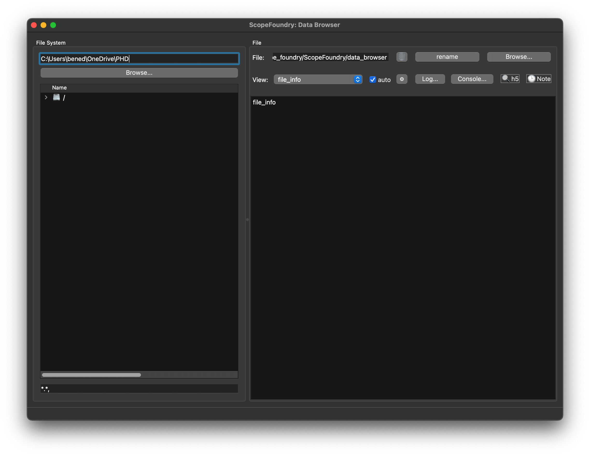

[getting_started_docs]:/docs/1_getting-started/

**Requirement:** [install scopefoundry][getting_started_docs]

To create the app and add viewer that ship with ScopeFoundry create this file:

```python
# fancy_data_browser.py
import sys

from ScopeFoundry.data_browser import DataBrowser
from ScopeFoundry.data_browser.plug_ins.h5_search import H5SearchPlugIn
from ScopeFoundry.data_browser.plug_ins.time_note import TimeNote
from ScopeFoundry.data_browser.viewers import H5TreeView, RangedOptimizationH5View
from ScopeFoundry.helper_funcs import sibling_path

# LOGO_PATH = "your_logo.png"


class MyDataBrowser(DataBrowser):

    def setup(self):

        self.add_plugin(H5SearchPlugIn(self))
        self.add_plugin(TimeNote(self))

        self.add_view(H5TreeView(self))
        self.add_view(RangedOptimizationH5View(self))


if __name__ == "__main__":
    app = MyDataBrowser(sys.argv)
    # app.set_logo(LOGO_PATH)
    # app.settings_load_ini("defaults.ini")

    sys.exit(app.exec_())

```


resulting in:





next [learn to create a Viewer](../2_data-browser-viewer)
