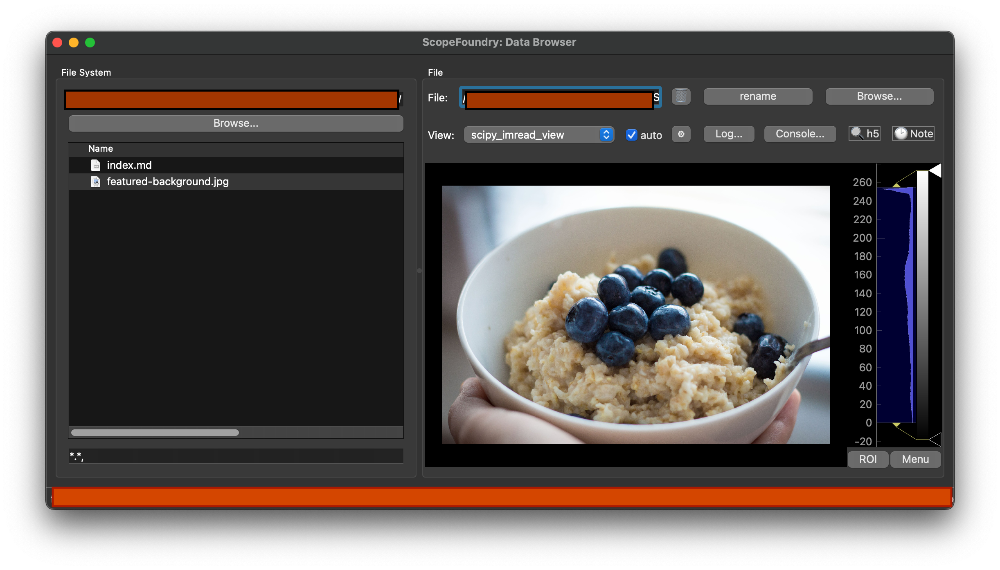

Let's define a custom view. We do this by subclassing the `DataBrowserView` class. Three methods should be defined: `setup()`, `is_file_supported()`, and `on_change_data_filename()`.

Here is an example of a simple data viewer that uses a PyQtGraph `ImageView` to display an image loaded via Matplotlib. Create a file in a subfolder `viewers/images.py`:

```python
# viewers/images.py
import os

import numpy as np
import pyqtgraph as pg
from matplotlib.pyplot import imread

from ScopeFoundry.data_browser import DataBrowserView


class MatplotlibImreadView(DataBrowserView):

    # This name is used in the GUI for the DataBrowser
    name = "matplot_imread_view"

    def setup(self):
        # Create the GUI and viewer settings, runs once at program startup
        # self.ui should be a QWidget of some sort, here we use a PyQtGraph ImageView
        self.ui = self.imview = pg.ImageView()

    def is_file_supported(self, fname):
        # Tells the DataBrowser whether this plug-in would likely be able
        # to read the given file name
        # Here we are using the file extension to make a guess
        _, ext = os.path.splitext(fname)
        return ext.lower() in [".png", ".tif", ".tiff", ".jpg"]

    def on_change_data_filename(self, fname):
        # A new file has been selected by the user, load and display it
        try:
            self.data = imread(fname)
            self.imview.setImage(self.data.swapaxes(0, 1))
        except Exception as err:
            # When a failure to load occurs, zero out the image
            # and show an error message
            self.imview.setImage(np.zeros((10, 10)))
            self.databrowser.ui.statusbar.showMessage(
                "Failed to load %s:\n%s" % (fname, err)
            )
            raise err
```

## Adding the view

Add these lines to your `fancy_data_browser.py` [file created earlier](../1_data-browser-app/):

```python
        from viewers.images import MatplotlibImreadView
        app.add_view(MatplotlibImreadView(app))
```

The folder structure should be of this form:

```sh
├── your_project_folder
        ...    

    ├── viewers
        ├── images.py    	
    ├── fancy_data_browser.py
```

Here is a resulting screenshot of running this data browser script and navigating to a folder with a PNG image:

