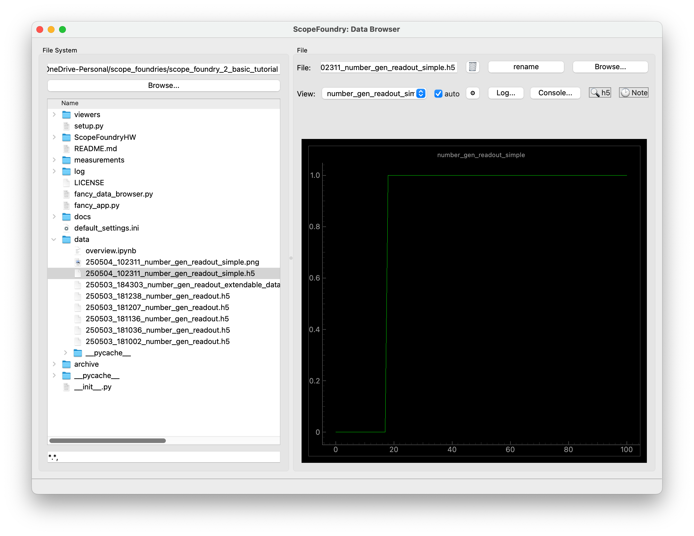

In the previous tutorial, you learned how to create a `DataBrowserView`. Here, we provide tips for faster development after creating a `ScopeFoundry.Measurement`.

1. Run a measurement, hit [Analyze with ipynb](/docs/30_tips-and-tricks/analyze-with-ipynb/), and copy the `.h5_dataloaders` file next to your viewer files. You may rename it to avoid conflicts.

2. From your `ScopeFoundry.Measurement`, copy the following methods:
   1. `setup_figure`
   2. `update_display`

   However, slight modifications, mainly deletions, may still be required.

3. Ensure your `DataBrowserView` subclass is named the same as the measurement. Otherwise, override the `on_change_filename` method.


4. Link it with this boilerplate code.
    ```python
          def setup(self):
              self.setup_figure()
    
          def on_change_data_filename(self, fname):
              self.data = load(fname)
    
              self.update_display()
    ```
5. Add the viewer to your data browser app.

  ```python
        self.add_view(RandomNumberGenView(self))

  ```


## Putting Everything Together

For the `random_number_gen_simple.py` example from the previous tutorial, the code becomes:

```python
# viewers/random_number_gen.py
from qtpy import QtWidgets
import pyqtgraph as pg

from ScopeFoundry.data_browser import DataBrowserView

# Import the load function from the h5_data_loader.py file generated by Analyze with ipynb.
from .random_number_gen_h5_data_loaders import load_number_gen_readout_simple


class RandomNumberGenView(DataBrowserView):

    # This name is used in the GUI for the DataBrowser
    name = "number_gen_readout_simple"

    def setup(self):
        self.setup_figure()

    def on_change_data_filename(self, fname):
        self.data = load_number_gen_readout_simple(fname)
        self.update_display()

    def setup_figure(self):
        """
        Runs once during app initialization and is responsible
        for creating the widget `self.ui`.
        """
        self.ui = QtWidgets.QWidget()
        layout = QtWidgets.QVBoxLayout()
        self.ui.setLayout(layout)

        # Create a plot widget
        self.graphics_widget = pg.GraphicsLayoutWidget(border=(100, 100, 100))
        self.plot = self.graphics_widget.addPlot(title=self.name)
        self.plot_lines = {"y": self.plot.plot(pen="g")}
        layout.addWidget(self.graphics_widget)

    def update_display(self):
        self.plot_lines["y"].setData(self.data.y)  # NEEDED MODIFICATION HERE
```


With following two lines in your app, the viewer will look like.


```
        from viewers.random_number_gen import RandomNumberGenView
        self.add_view(RandomNumberGenView(self))
```




## Next Steps

- [DataBrowserPlugIn](/docs/12_databrowser-tutorials/5_data-browser-plugin/)
