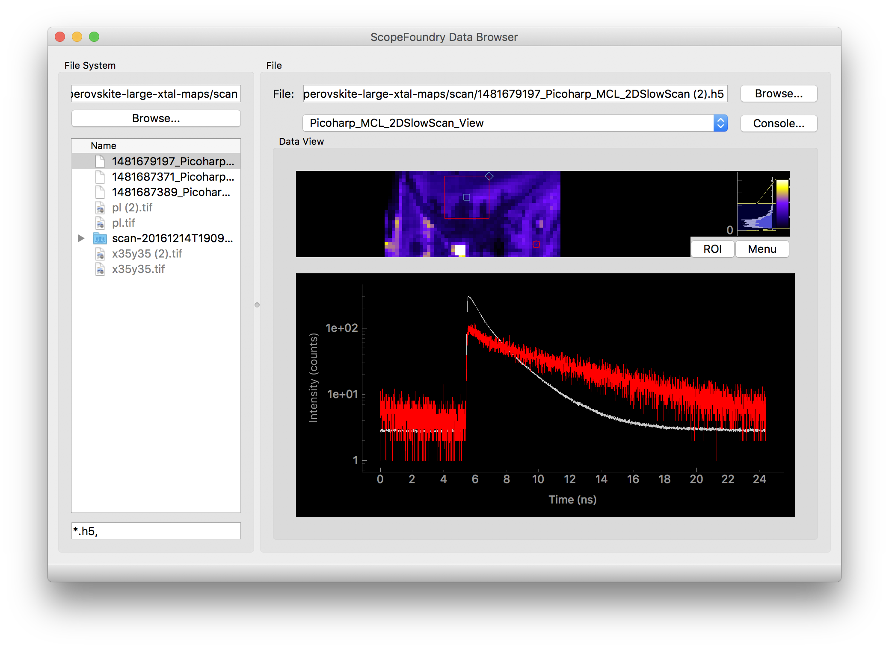

[getting_started_docs]:/docs/1_getting-started/

ScopeFoundry provides a DataBrowserApp that makes it easy for a user to explore a set of experiemental results on their computer. It is a plug-in based application, where data-type plug-ins (a `DataBrowserView`) can show relevant data within the file. The [FoundryDataBrowser] project is an example of the ScopeFoundry DataBrowser with a number of Views used to browse common experiemental data the Molecular Foundry.

**Requirement:** [install scopefoundry][getting_started_docs]

Steps

1. [Make a databrowser app](1_data-browser-app)
2. [Make a image viewer](2_data-browser-viewer) example that show images
3. [Make a .h5 viewer](2_data-browser-viewer) that handles your costume file format and displays the data as you like.
