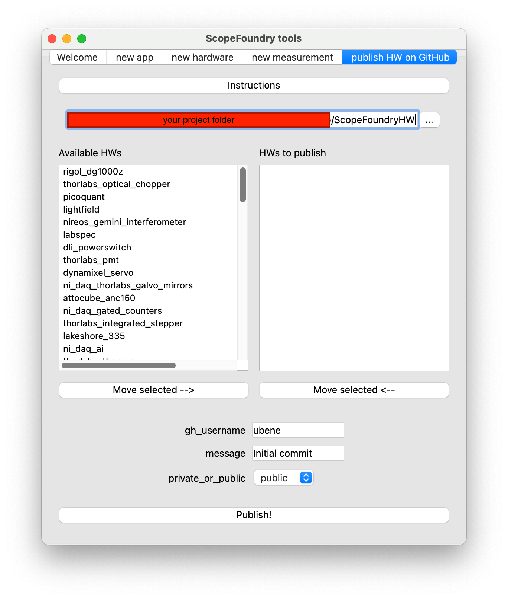
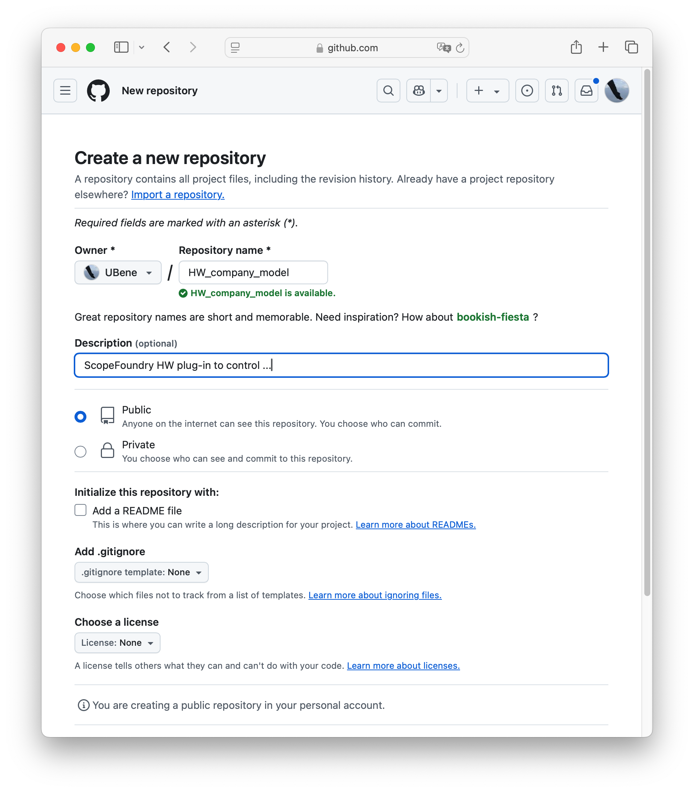

The following instructions explain how to publish `company_model` in your project folder's `ScopeFoundryHW` directory using Git. 

We recommend the following folder structure, which can be generated with [ScopeFoundry.tools](/docs/11_tools-tutorials/2_hardware-1/#the-template).

```
├── your_project_folder/
   ├── ScopeFoundryHW/
      ├── company_model/
         ├── company_model_hw.py					
         ├── Licence
         ├── README.md
         # optional
         ├── company_model_dev.py			
         ├── company_model_test_app.py
         ├── .gitignore
         ├── docs/
            ├── links.json 
         ├── ** more files/directories that make your hardware component work
         
    **
```

We recommend using the following `.gitignore` file, as it is generally not advisable to track measurement and log data:

```plaintext
# .gitignore
*.pyc
*.h5
*log*.txt
```


## Publish with tools

{}
New in ScopeFoundry 2.1. This is equivalent to publish manually described bellow.
{}

#### Prerequisites

1. **Install Git and make a GitHub account**

2. **Install GitHub CLI**  
   Ensure you have the GitHub CLI installed. You can install it using `conda`:

   ```bash
   conda install gh --channel conda-forge
   ```

3. **Set Up GitHub Authentication**
    The first time you use the publishing tools, you may need to authenticate with GitHub. Follow the prompts to generate and use a personal access token if required.

    ```
    gh auth login
    ```

    and follow the prompts to give the CLI an access token.

#### Instructions

Navigate to your_project_folder and use the following command to start the tools to publish your hardware component:


```python
python -m ScopeFoundry publish_hw
```



The left list should contain a list of available hardware components. If not, make sure that the path above the lists points to your ScopeFoundryHW folder. On the right side, you will see a list of hardware components that will be published. Use the buttons to move items between lists. Fill out the remaining fields and hit **Publish**!


## Discoverable on This Page

This page periodically crawls GitHub for HW_* repositories. It considers users/organizations that forked the ScopeFoundry repository. Your hardware repository will be found if:

- You fork [ScopeFoundry/ScopeFoundry](https://github.com/ScopeFoundry/ScopeFoundry).
- You name your hardware repository starting with `HW_`.

## Adding Published Plug-ins to Your Project

To add an existing repo on GitHub  into to your project's hardware folder, navigate to your project folder (`cd to/your_project_folder/`) and use the following command (requires [Git](/docs/100_development-environment/20_git/)):

```sh
git submodule add https://github.com/{THEIR_USER_NAME}/HW_{company_model}.git ScopeFoundryHW/{company_model}
```

Where `{THEIR_USER_NAME}` and `{company_name}` need to be replaced accordingly. **Hint:** The entries in the [Library](/docs/301_existing-hardware-components/) contain this line completed for the respective HardwareComponent. 

Note: The `HW_` prefix is removed in the target folder name.

If you plan to share changes you make to this code, it is wise to first fork the repository and then clone the forked version (see below).

## Updating Already Published Plug-ins

If it is your repository, i.e you have write access, then simply push to it and you are done. 

**Otherwise:**

1. Sign up or log in to GitHub with your `USER_NAME`.  
2. Fork the GitHub repository you like to make contribution to.

Now you have a GitHub repository URL (with your `USER_NAME`) of the form: `https://github.com/{USER_NAME}/HW_{company_model}.git`. 

1. Navigate to the folder of the hardware component:
   ```sh
   cd to/your_project_folder/ScopeFoundryHW/{company_model}
   ```

2. Commit your code. To wrap all changes in one commit (not necessarily recommended):
   ```sh
   git add -A && git commit -m "Describe your contribution"
   ```

3. Push your code to the remote repository:
   ```sh
   git remote add origin https://github.com/{USER_NAME}/HW_{company_model}.git
   git push -u origin
   ```

To share your contributions with the original owner, create a Pull Request on GitHub, and they can decide if they like to merge your contributions.


## Publish manually

{}
This is equivalent to publish with tools described above.
{}

1. Initialize a Git repository locally (`cd ScopeFoundryHW/{company_model}`):

   ```sh
   git init --initial-branch=main
   ```

2. Commit your code. For the first commit, assuming you commit all files at once:

   ```sh
   git add -A && git commit -m "Initial release"
   ```

3. Create the target repository on GitHub by prepending `HW_` to the package name:

   1. Sign up or log in to GitHub with your `USER_NAME`.  
   2. Create a new public repository named `HW_{company_model}`.  
        
   3. Note the repository URL for the next step.  
      

4. Push your code to the remote repository:

   ```sh
   git remote add origin https://github.com/{USER_NAME}/HW_{company_model}.git
   git branch -M main
   git push -u origin main
   ```