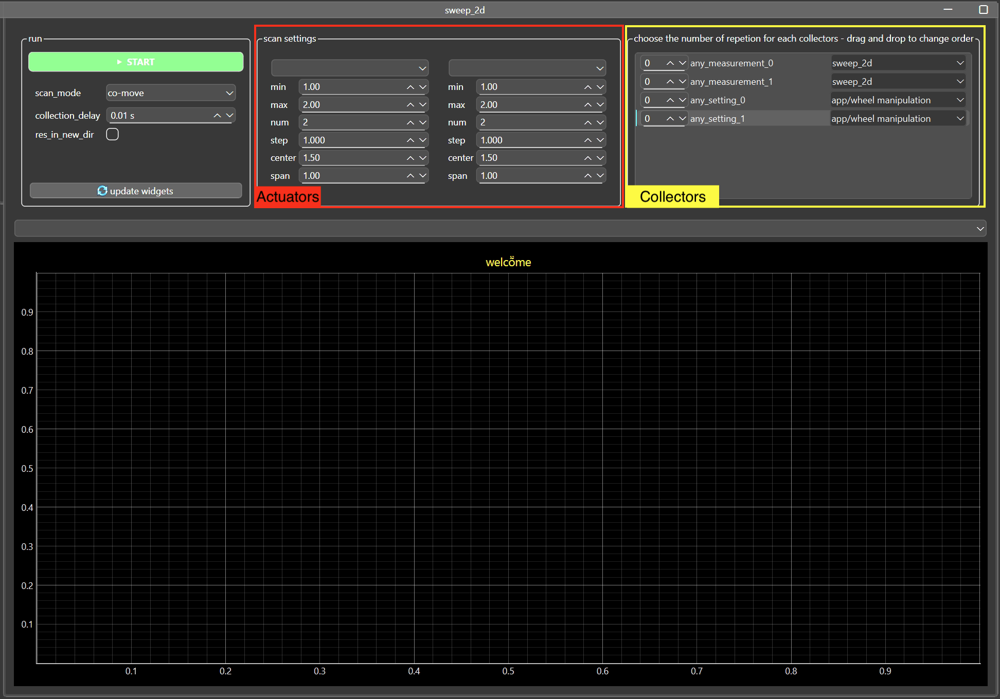

{}
New in ScopeFoundry 2.2
{}

These built-in Measurements iteratively vary the position of an actuator and collect data at each point in a generic fashion. To use the out-of-the-box solution, you can add them to your app:

```python
class MyFancyApp(BaseMicroscopeApp):

    name = "My Fancy App"

    def setup(self):
        from ScopeFoundry import Map2D, Sweep1D, Sweep2D, Sweep3D, Sweep4D
        self.add_measurement(Sweep2D(self))
        ...
```



Depending on the dimensionality, i.e., the number of actuators varied, use:

   - Sweep1D
   - Sweep2D
   - Sweep3D
   - Sweep4D
   - Map2D

Easy-to-use configurations [below](#more-configurations). 

Most sweeping tasks are already solved with this out-of-the-box solution. This article aims to outline further configurability that elevates the usage of these sweep classes. Note that MapXD extends SweepXD with features that paricularly apply for spattial mapping.

## Basic Concepts

The two central ingredients are so-called:

1. *"Actuators"*, the objects that are being varied. These can be defined using a settings path or by providing a function (see costume actuator). Such a setting only requires a hardware write function. As settings only get associated with hardware write functions after they are connected the list of possible actuators can be updated after connecting to hardware by pressing the appropriate button in the UI.
   
2. *"Collectors"*, responsible for collecting data at each sweep point. The user can activate multiple collectors and can change the order in which they are executed by dragging and dropping. Further, each collector can be repeated. For more info on collectors, see below.

## Collectors

Define how data is collected and what is collected at each sweep point.

- If you just want to read a hardware setting, you can use the out-of-the-box *read_any_settings* option.

- If you want to run any of your measurements at each sweep point, you *might* get away with using the *any_measurement* option. The resulting data file of the sweep measurement only contains data of the specified sub-measurement if the sub-measurement defines a dictionary named `data`. So this feature works best if all your target measurements populate a dictionary `data` with your data.

### Costume collector

The *any_measurement* is not further configurable. If you need to configure data collection further, implement your own collector class and pass it to your Sweep class. This becomes particularly interesting if you want to use multiple collectors at a given actuator state and each collector requires changing state of the setup before collection.

Here is an example that moves the shutter before and after reading powers (using a target_measurement "power_readout" that implements a "get_data" method):

  ```python
  # shuttered_power_collector.py
  from ScopeFoundry import Collector
  
  class ShutteredPowerCollector(Collector):
  
      name = "power_measurement_with_shutter"
      target_measure_name = "power_readout"
      repeated_dset_names = ("powers",)
  
      def prepare(self, host_measurement, *args, **kwargs):
          self.app.hardware.my_shutter.settings["position"] = "open"
  
      def run(
          self,
          index,
          host_measurement, # host measurement is the Sweep Measurement
          polling_func=None,
          polling_time=0.001,
          int_time=None,
          **kwargs,
      ):
          # self.target_measure.settings["integration_time"] = int_time
          
          # run a "target measurement" here as defined with the target_measure_name above
          host_measurement.start_nested_measure_and_wait(
              self.target_measure,
              nested_interrupt=False,
              polling_func=polling_func,
              polling_time=polling_time,
          )
          
          # populate the data dictionary of the collector. The host_measurement, i.e., the Sweep class, will incorporate this data for each repetition and sweep point.
          self.data["powers"] = self.target_measure.get_data()
  
      def release(self, host_measurement, *args, **kwargs) -> None:
          self.app.hardware.my_shutter.settings["position"] = "close"
  ```

  The sweep measurement calls these 3 functions at each sweep point in the following order:

  1. `prepare` exactly one time. (If you find yourself repeating code for all your custom collectors, you might be better off with a [costume actuator](#costume-actuators))

  2. `run` according to the number of repetitions the user specified. Note that the Sweep Measurement incorporates the content of the  `data` dictionary. 

     The attribute `repeated_dset_names = ("powers",)`  informs the sweep measurement that only "powers" is collected for every repetition at each sweep point.

  3. `release` exactly one time.

​	To add your collector to the sweeps, alter the app file:

```python
class MyFancyApp(BaseMicroscopeApp):

    name = "My Fancy App"

    def setup(self):
        from .shuttered_power_collector import ShutteredPowerCollector
        
        collectors = [ShutteredPowerCollector]
        
        from ScopeFoundry import Map2D, Sweep1D, Sweep2D, Sweep3D, Sweep4D
        self.add_measurement(Sweep2D(self, collectors=collectors))
        ...
```

## Actuators

Out of the box, actuators are defined using any lq_path that points to a setting with a write_to_hardware function. The list of possible actuators can be updated with the appropriate button.

However, you can explicitly add lq_paths as actuators that appear at the top of the list and can be named with more intuitive names.

```python
explicit_actuators = [
    (
        "x", # intuitive name
        "hw/xyz_stage/x_target_position", # path to setting with hardware write function
    ), ...
]
```

Note that the above actuator is defined with a tuple of length 2. However, it is recommended (when applicable) to also pass a path to a setting that is associated with a hardware_read_function. This function is called after the actuator is set and is included in the resulting data file.

```python
explicit_actuators = [
    (
      "x", # intuitive name
      "hw/xyz_stage/x_target_position", # path to setting with hardware write function
      "hw/xyz_stage/x_position", # path to setting with hardware read function
    ), ...
]
```

Either way, to add them to your measurement, alter the app file:

```python
        self.add_measurement(Sweep2D(self, actuators=explicit_actuators))
```

### Costume Actuators

The above defines an actuator with lq_paths. You can define more sofisticated actutators by at least defining write function with excalty the new position as an argument. 

```python
class MyFancyApp(BaseMicroscopeApp):

    name = "My Fancy App"
    
    def my_actuator_write_function(self, new_position):
        # new_position 
        self.hardware.my_hardware.settings["target_position"] = new_position
        self.hardware.my_hardware_2.settings["target_position"] = new_position ** 2
        # potentially wait until values are set.
        ...

    def my_actuator_read_function(self) -> float:
        pass
        # return a value

    def setup(self):
        ...
        actuators = [("generic_actuator", self.my_actuator_write_function, self.my_actuator_read_function),]
        
        from ScopeFoundry import Map2D, Sweep1D, Sweep2D, Sweep3D, Sweep4D
        self.add_measurement(Sweep2D(self, actuators=actuators))
        ...
```
The read_function is not required and be completely omitted.

## More Configurations

- If you want read_any_setting and any_measurements, change the initializer:

  ```python
           self.add_measurement(Sweep2D(self, n_any_measurements=5, n_read_any_settings=5))
  ```

- The values that are swept (the sweep array) are by default defined using a start, stop, num pattern to define a single interval with equally spaced values. You can use multiple intervals to define several intervals (with varying density of values).
  ```python
        self.add_measurement(Sweep2D(self, range_n_intervals=(3, 5)))
  ```
  Here the first actuator can use up to 3 intervals to define its values, and the second up to 5 to define its values.
