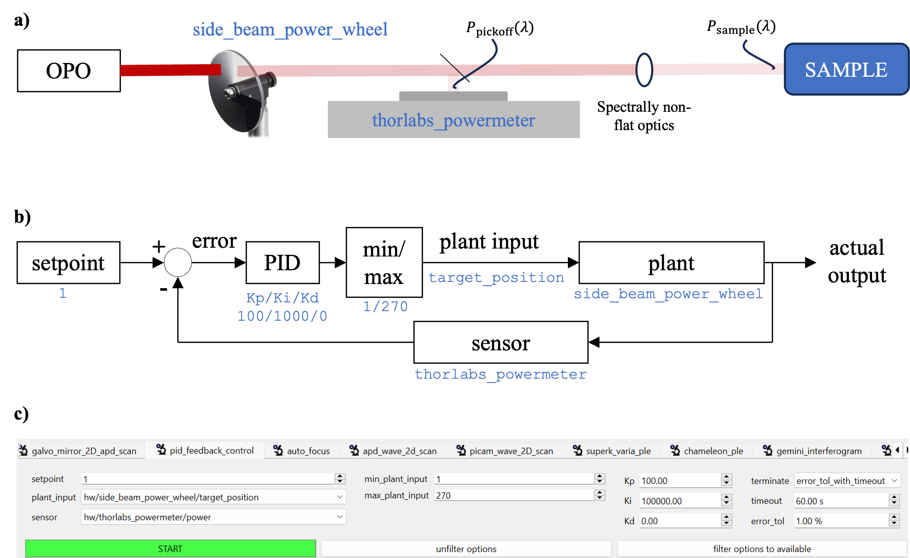

1. This plug-in relies on the `simple-pid` (v2+) library. Install it (don't forget to `conda activate scopefoundry` if necessary):

    ```bash
    pip install simple-pid
    ```

2. Add `PIDFeedbackControl` to your app:

    ```python
    # fancy_app.py
    from ScopeFoundry import BaseMicroscopeApp


    class FancyApp(BaseMicroscopeApp):
    
        name = "fancy_app"
    
        def setup(self):
    
            from ScopeFoundry.controlling import PIDFeedbackControl
            self.add_measurement(PIDFeedbackControl)
    ```

3. Refer to the following figure to define the control:  
   

   **a)** The system used in this example: a laser beam from the OPO is controlled by a motorized ND filter wheel ("Plant"). The power of the laser beam is monitored at a pickoff location using a power meter ("Sensor"). (Ignore the rest of figure a).)  

   **b)** Control loop diagram. It is a standart PID feeback control except that the range  of input to the plant are constrained (min/max block).

   **c)** The GUI of `PIDFeedbackControl`:  

   - Define the setpoint.  
   - `plant_input` (position of the motor of the ND filter wheel, `side_beam_power_wheel`).  
   - `sensor` is the power readout of a power meter (`thorlabs_powermeter` as a sensor) by moving an ND density filter wheel (as the plant).  
   - The PID controller with the usual 3 parameters.  
   - Note that the input to the plant can be constrained by (`min_plant_input`, `max_plant_input`).  
   - Lastly, you can define when the measurement terminates.