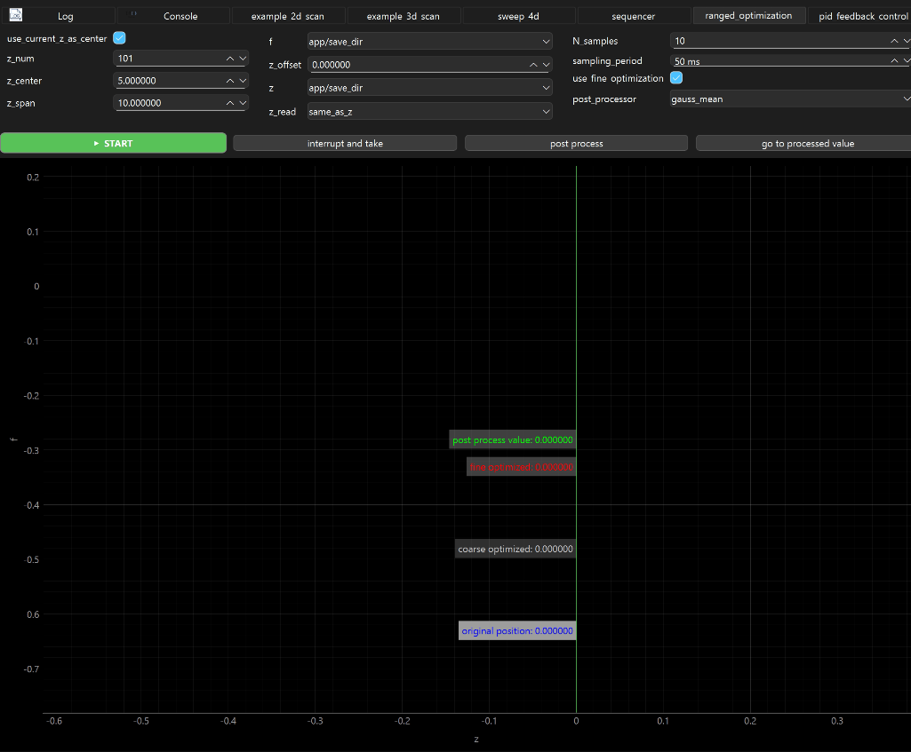

Sweeps a setting \\(z\\) within a range, measures an optimization quantity \\(f(z)\\) and calculates \\(z_0\\) such that:


```math
f(z_0) >= f(z) \, \forall z
```

finally sets \\(z = z_0 + z_{offset}\\)


### add to your app:

```python
    def setup(self):

        from ScopeFoundry import RangedOptimization

        self.add_measurement(RangedOptimization(self))
```


