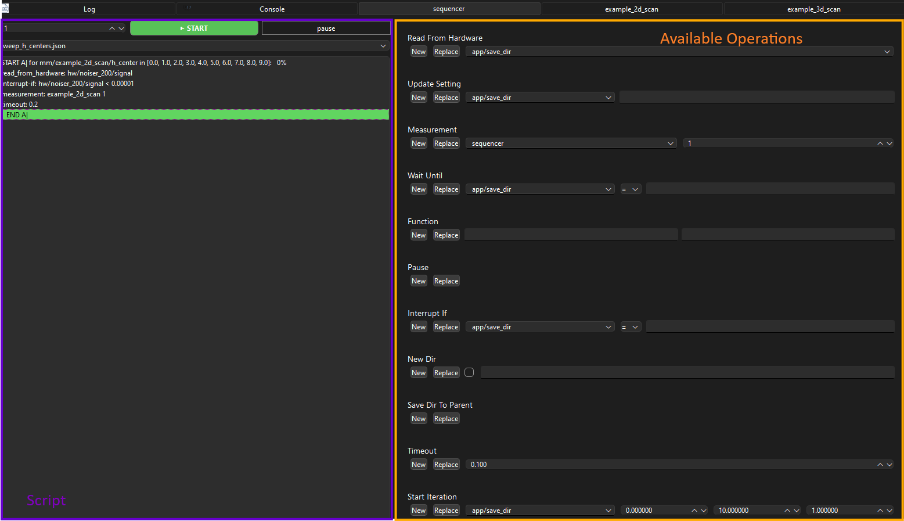

To add the Sequencer to your app:

```python
    def setup(self):

        from ScopeFoundry import Sequencer, SweepSequencer

        self.add_measurement(Sequencer)
```

Check the available operations in the right panel. Hover over an operation's label to display its description.

On the left panel, you can see the actual script. Note that it can be saved for later reuse.



Another measurement, `SweepSequencer`, wraps the `Sequencer` into an additional for-loop.