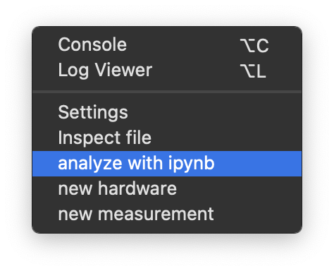
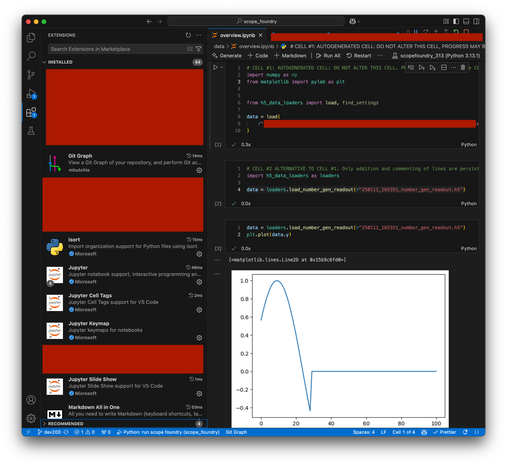

[getting_started_docs]: /docs/1_getting-started/

This feature works best with Jupyter Notebook installed. We recommend the following steps:

1. Install [Visual Studio Code](https://code.visualstudio.com/download).
2. Install the following extensions:
   1. Pylance (Microsoft)
   2. Jupyter (Microsoft)

There are two ways to start this feature:

### In the app:

Navigate to **Advanced -> Analyze with ipynb**. The folder acted upon is the one defined in the `app/save_dir` settings (bottom left panel).



### Without the app:

Using ScopeFoundry tools (install instructions [here][getting_started_docs]):

```sh
cd "to/your_folder_with_data"
```

If necessary, activate the ScopeFoundry environment:

```sh
conda activate scopefoundry
```

Then run the following command:

```sh
python -m ScopeFoundry.tools
```

Click the button on the Welcome tab to proceed.

## Result

This feature generates the following:

1. An `h5_data_loaders.py` file containing convenience methods based on the contents of the `.h5` files.
2. An `overview.ipynb` file where you can start your analysis.



In the notebook, the top two cells are generated:

- **Cell 1**: Imports the data loaders.
- **Cell 2**: Lists paths to each `.h5` file and demonstrates how they can be loaded.

## Retriggering

It is generally safe to re-trigger this feature with the caveat:

- Cell 3 and onwards are not altered.
- Cell 2 has logic to only add lines that do not already exist.
- **Cell 1 will be overwritten**:  Avoid making changes to it. 