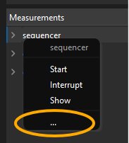

{}
New in ScopeFoundry 2.1
{}

To document your HardwareComponents and your Measurements, right click on their respective entry in the trees (on the left) and click the `...` symbol. 

This will open the folder where your documentation file should be placed. Note, the folder contains a special file,  `links.json`, where you can define hyperlinks to your websites that document your component (using python dictionary notation `{"my_link":"website.com"}`). Next time you right click on the entry in the tree, the pop-up will list clickable entries of files in that folder and the defined hyperlinks.

Analogues, for app level documentation, click on Help -> `...`.

