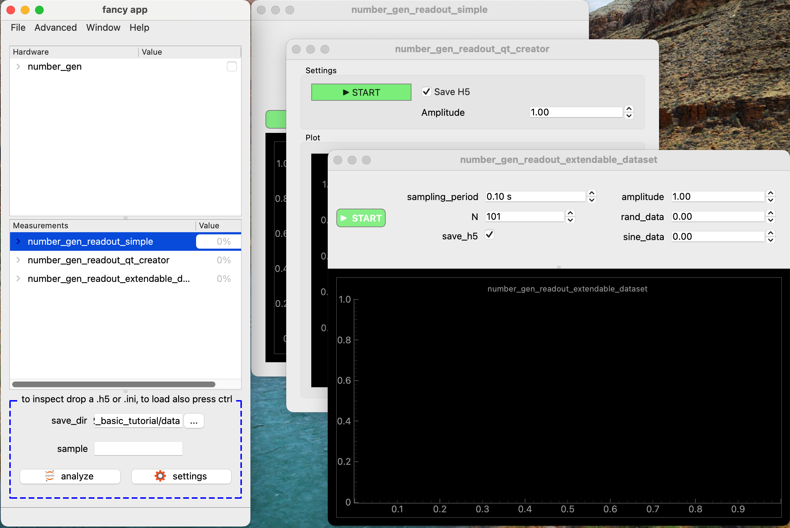

By setting the `mdi = False` at the app class definition, the loading of measurement UIs is omitted at startup. This significantly reduced at startup time. Nevertheless, the UIs can be loaded individually at a later time.

```python
class FancyApp(BaseMicroscopeApp):

    name = "fancy app"
    mdi = False
```


