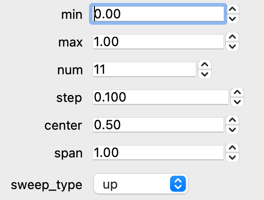

```python
from ScopeFoundry.measurement import Measurement


class XSweep(Measurement):

    name = "x_sweep"

    def setup(self):
        # Define a range of X-values with start, stop, and step
        self.range = self.settings.New_Range("X", include_center_span=True, include_sweep_type=True, initials=(1, 2, 2))

    def run(self):
        # Access the array of X-values
        for x in self.range.sweep_array:
            # Perform operations for each X-value
            ...
```

The `New_Range` method, as called above, creates six settings that allow the user to define a range of values. Three of these six settings are redundant.

To define the range, the user can either use:

- `X_start`  
- `X_stop`  

*or:*

- `X_range`  
- `X_center`  

To define the step size, the user can either use:

- `X_step`  

*or:*

- `X_num`.  

To add corresponding widgets to your `.ui`:

```python
    def setup_figure(self):
        ...
        new_widget = self.range.New_UI() 
        ...
```



The `sweep_type` determines how the values are traversed.

## Multi interval ranges

{}
New in ScopeFoundry 2.2
{}

Define a range of X-values with up to n (bellow set to 5) intervals, each interval having a start, stop, and step setting.

```python
from ScopeFoundry.measurement import Measurement


class XSweep(Measurement):

    name = "x_sweep"

    def setup(self):

        self.range = self.settings.new_intervaled_range("X",
          n_intervals=5,
          include_center_span: bool = False,
          include_sweep_type: bool = False,
          initials=None,
          unit=None,
          si=False,
          ro=False,
          vmin=-1_000_000_000_000,
          vmax=1_000_000_000_000,
          spinbox_decimals=4,
          description="",
          **kwargs
        )
        
    def run(self):
        # Access the array of X-values
        for x in self.range.sweep_array:
            # Perform operations for each X-value
            ...
```