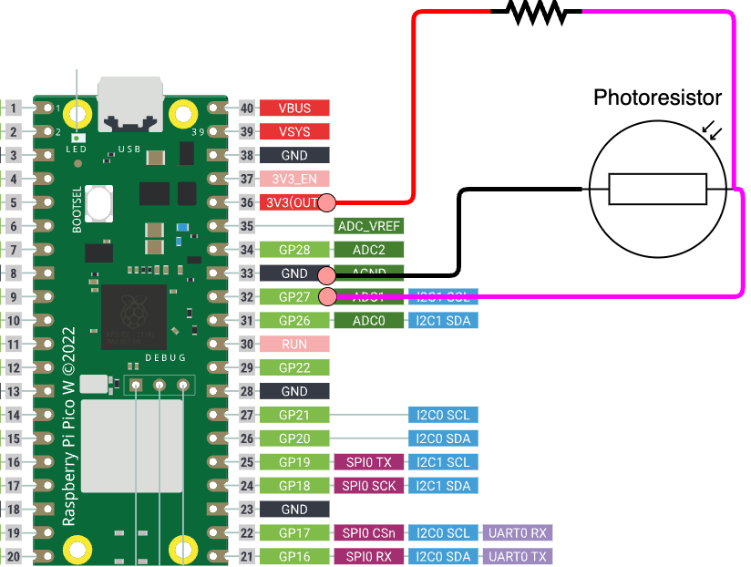

[getting_started_docs]:/docs/1_getting-started/

## Step 0: Instrument Hardware

This ScopeFoundry demo hardware is a simple example of a microcontroller that illustrates how you can use serial communication to set output parameters and read in real world analog signals, all for $6. See the [Demo HW tutorial](100_demo_pico_hw) on getting this set up. If you don't have the parts, this tutorial will allow you to simulate this device.




## Step 1: Installing Python and ScopeFoundry

{}
04/21/2025: Step 1 is potentially dated. Do [Getting started](/docs/1_getting-started/) instead.
{}


[anaconda_dl]: https://www.anaconda.com/download/success

Note: We recommend the [Anaconda][anaconda_dl] Python distribution, which contains many easy-to-install scientific python packages.

* Download and Install [Anaconda][anaconda_dl]. The recommended Python version is 3.11, other Python 3 versions should work, but are not actively tested. If you already had a non-Anaconda version of python installed, you will need to make sure you use Anaconda if you would like to follow the instructions below.

* Anaconda provides a way to make a clean set of packages in an "environment". Follow these steps to create an [conda environment](http://conda.pydata.org/docs/using/envs.html). This environment includes ScopeFoundry and all of the packages ScopeFoundry needs to run. 

__Windows__
    
Open an Anaconda prompt and run the following commands:
    

```
> conda create -n scopefoundry python=3.11
> conda activate scopefoundry
(scopefoundry) > conda install numpy pyqt qtpy h5py pyqtgraph pyserial matplotlib qtconsole
(scopefoundry) > pip install ScopeFoundry
```
The first two lines create and activate a clean python / conda environment for your ScopeFoundry app to use, the next lines install the required packages and the final line install the ScopeFoundry package itself.    

The use of the conda environment is optional, but provides a clean, known working environment for ScopeFoundry

__Mac / Linux__

Open a terminal and run the following commands:

```
$ conda create -n scopefoundry python=3.11
$ conda activate scopefoundry
(scopefoundry) $ conda install numpy pyqt qtpy h5py pyqtgraph
(scopefoundry) $ pip install ScopeFoundry
```

The first two lines create and activate a clean python / conda environment for your ScopeFoundry app to use, the next lines install the required packages and the final line install the ScopeFoundry package itself.  

## Step 2: Create your Microscope App

### picodemo_app.py
```python
from ScopeFoundry import BaseMicroscopeApp

class PicoDemoMicroscopeApp(BaseMicroscopeApp):

    # this is the name of the microscope that ScopeFoundry uses 
    # when storing data
    name = 'pico_demo_app'
    
    # You must define a setup function that adds all the 
    #capablities of the microscope and sets default settings
    def setup(self):
        
        #Add App wide settings
        # TODO
        
        #Add hardware components
        print("Adding Hardware Components")

        #Add measurement components
        print("Create Measurement objects")

        # Connect to custom gui
        # TODO 
        
        # load side panel UI
        # TODO 

        # Load Defaults
        # TODO 
        

if __name__ == '__main__':
    # Create an instance of your App
    app = PicoDemoMicroscopeApp() 
    # Run the App
    app.exec_()
```


Let's test our empty microscope app:

in your terminal window: `python pico_demo_app.py` and you will be greeted something like this:


There are 3 main parts to the user interface. A list of Hardware components, a list of Measurments, and a Tabbed area for Measurement user interfaces: 


An ideal microscope directory has the following structure:

Tree structure of a typical experiment repository

	├── .git/							# Stores Git repository information (version history)
	│   └── ...
	├── ScopeFoundryHW/					# Local copies of ScopeFoundry hardware plugins
	│   ├── demo_pico_hw/       		# Local sub-tree of specific hardware plugin
	│   └── ...
	├── hardware/				    	# Local Instrument specific hardware components
	│   └── ...
	├── measurements/					# Local Instrument specific measurements
	│   └── ...
	└── demo_microscope_app.py

## Hardware Component

Add the hardware component to your microscope app by adding these lines to your app's `setup()` function:

```python
class DemoPicoApp(BaseMicroscopeApp):

    name = 'demo_pico_app'

    def setup(self):

        from demo_pico_hw import DemoPicoHW
        self.add_hardware(DemoPicoHW(app=self))
```

We need two lines in the setup function to use this hardware component. The first line tells python where to find the hardware component, via an `import` statement. The next line creates an instance of the hardware (an active copy in memory), and then adds it to your App.

Notice that ScopeFoundry Hardware components by convension have the suffix "HW".

## Measurement Component

The `demo_pico_datalog_measure.py` file provides a way to capture the data, display and save the data from the our new hardware component. This is encapuslated in a ScopeFoundry `Measurement` class. Let's include a `pico_datalog` measurement in our App by adding a couple lines to our `setup()` function:

```python
    def setup(self):
        ...
        #Add Measurement components
        from demo_pico_datalog_measure import DemoPicoDataLogMeasurement
        self.add_measurement(DemoPicoDataLogMeasurement(app=self))
        ...
```

Notice, as a convention, ScopeFoundry Measurement class names have the suffix "Measure".