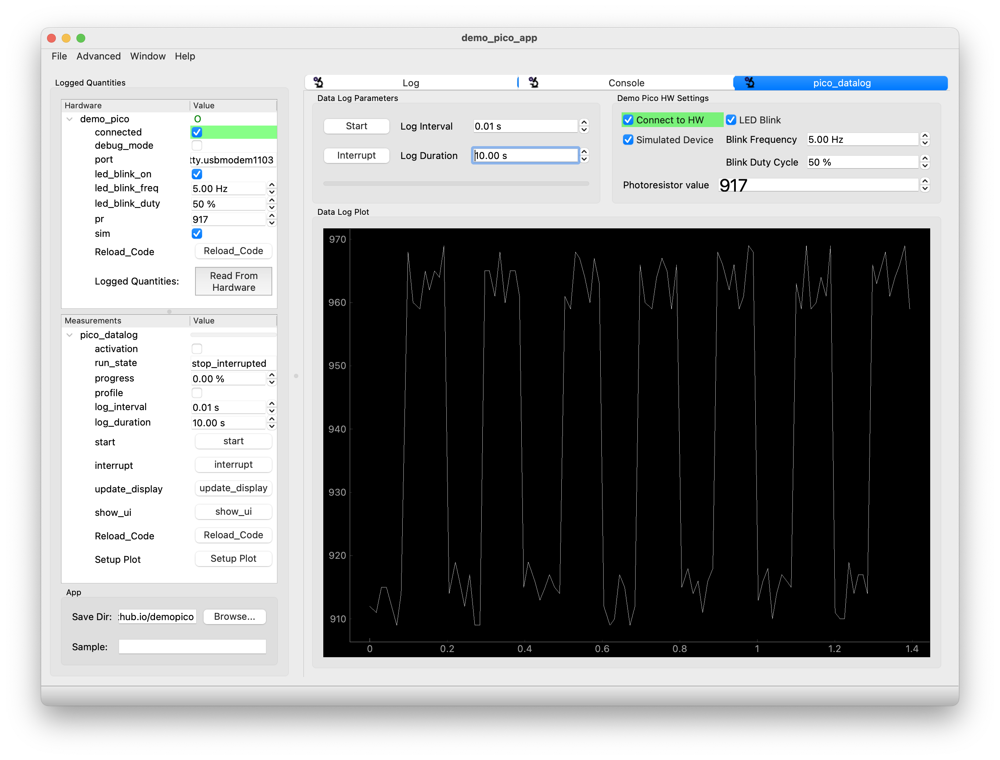

{}
This is the documentation of a workshop conducted in Summer 2024. To follow this workshop you need hardwares specified [here](/docs/500_demopico-docs/100_demo_pico_hw/#hardware-overview)
{}

{}
The repo for this workshop can be found [here](https://github.com/ScopeFoundry/demopico)
{}

## The Hardware

We will use a simple microcontroller that will blink an LED and read brightness from a photoresistor. We will program it with CircuitPython 

https://circuitpython.org/board/raspberry_pi_pico_w/

Plug in your fresh Raspberry Pi Pico W and it will show up as a USB drive called `RPI-RP2`

Download UF2 file for CircuitPython 9.1.1 and copy the `adafruit-circuitpython-raspberry_pi_pico_w-en_US-9.1.1.uf2` to the `RPI-RP2` drive

After the copying is complete a new USB drive will appear called `CIRCUITPY`