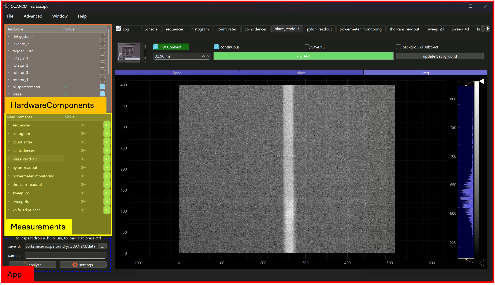

[getting_started_docs]:/docs/1_getting-started/
[tools_tutorials]:/docs/11_tools-tutorials/
[tips-and-tricks]:/docs/30_tips-and-tricks/
[built-in]:/docs/20_built-in-measurements/
[development]:/docs/100_development-environment/
[sharing_hws]:/docs/200_hardware-sharing/
[301_existing-hardware-components]:/docs/301_existing-hardware-components/
[core-development]:/docs/1000_core-development/
[DataBrowser-tutorials]:/docs/12_databrowser-tutorials/

ScopeFoundry is a framework with two types of plugins:

1. **HardwareComponents** - interfaces with hardware devices.
2. **Measurements** - contains the logic to set the state of devices, read data, and store it.

The framework provides an app, defines interfaces between plug-ins, and handles threading to run plugins concurrently.

Users of ScopeFoundry are required to develop these plugins (unless they already exist) and add them to the app.

## Plugin Development

This website provides tutorials for creating (and sharing) ScopeFoundry Apps, HardwareComponents, and Measurements. Depending on your familiarity with ScopeFoundry, we recommend:

1. [Getting Started][getting_started_docs]: Install ScopeFoundry.
2. [Basic Tutorial][tools_tutorials]: Learn the basics by implementing an app, a HardwareComponent and a Measurement.
3. [Tips and Tricks][tips-and-tricks]: Elevate your plugin development.
4. [Built-in Measurements][built-in]: Scanning, parameter sweeping, PID feedback control, Sequencer, and other common measurement tasks that ScopeFoundry solves generically.
5. Check the [HardwareComponents Library][301_existing-hardware-components] for existing plugins.
6. To share and contribute to plugins, click [here][sharing_hws].

## ScopeFoundry.DataBrowser

Somewhat independent of the above is the ScopeFoundry.DataBrowser - an app that can be used for quick data inspection. Learn how to create the app and write DataBrowser plugins using [this tutorial][DataBrowser-tutorials].

## ScopeFoundry Core Development

To contribute to the ScopeFoundry framework, go to [core development][core-development].

## Report an Issue.

To report an issue with **this documentation**, click [here](https://github.com/ScopeFoundry/scopefoundry.github.io/issues).

To report a bug or request a feature with **ScopeFoundry**, click [here](https://github.com/ScopeFoundry/ScopeFoundry/issues).