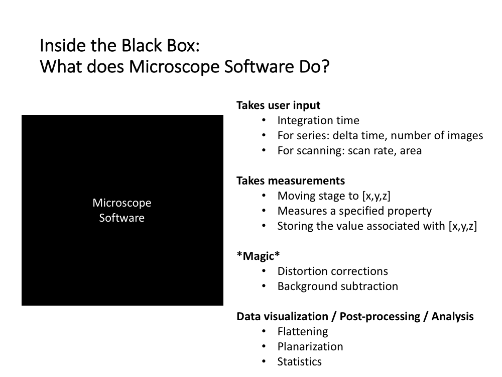
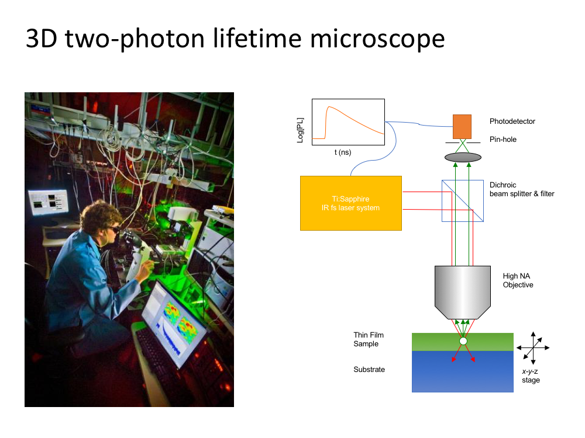
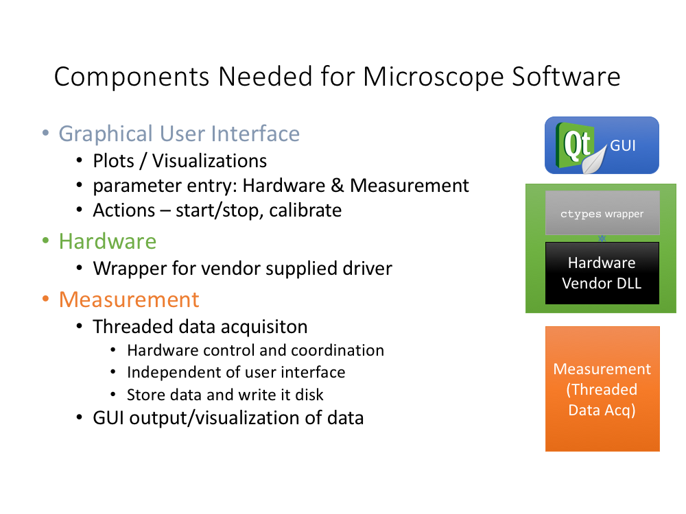
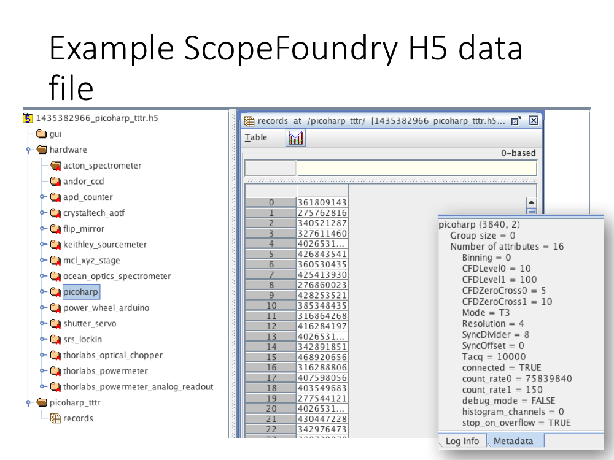

## Why ScopeFoundry

An example in our lab:

## Components Needed for Microscope Software

A visual guide:

## Structure of a ScopeFoundry Microscope App

## Syncronized Settings: The `LoggedQuantity`

A central component you will see at all levels of a ScopeFoundry program is a "LoggedQuantity", an object representation of a hardware or software setting.

## Hardware Plug-ins

## Measurement Modules

## Data Storage

