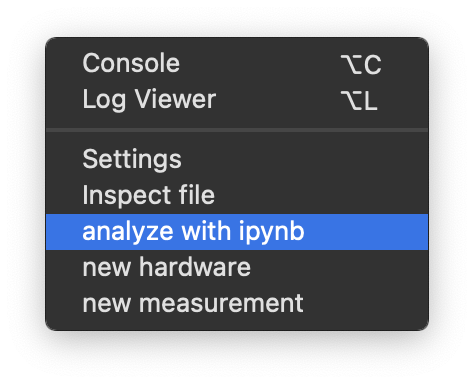

## Recommendation

This feature works best if the machine you are working on has Jupyter notebook installed such that double-clicking opens it. One *recommended* way:

1. Install [Visual Studio Code](https://code.visualstudio.com/download)
2. Install extensions:
   1. Pylance (Microsoft)
   2. Jupyter (Microsoft)
3. Select ScopeFoundry interpreter


## Trigger feature

There are 2 ways to start that feature. Either way, the feature acts on a folder that contains (itself or its subdirectories) .h5 files

1. From ScopeFoundry: Advanced -> analyze with ipynb. The folder acted upon is the one defined in the `app/save_dir` settings (bottom left panel)

    

2. Using ScopeFoundry tools ([requires ScopeFoundry 2.0+ see getting started tutorial](/docs/10_tutorials/1_getting-started))

```sh
cd "to/your_data_folder"
conda activate scopefoundry 
# or for mac: 
# source activate scopefoundry
python -m ScopeFoundry.tools
```

​	and clicking the corresponding button. 

The result is that it:

1. Generates a h5_data_loaders.py file containing convenience methods based on the .h5 files content
2. Generates an overview.ipynb where you can do the analysis
3. If applicable, will launch VS Code or equivalent. Otherwise, open overview.ipynb manually


In cell 1: the necessary imports are done.

In cell 2: lines that would load each .h5 file 
