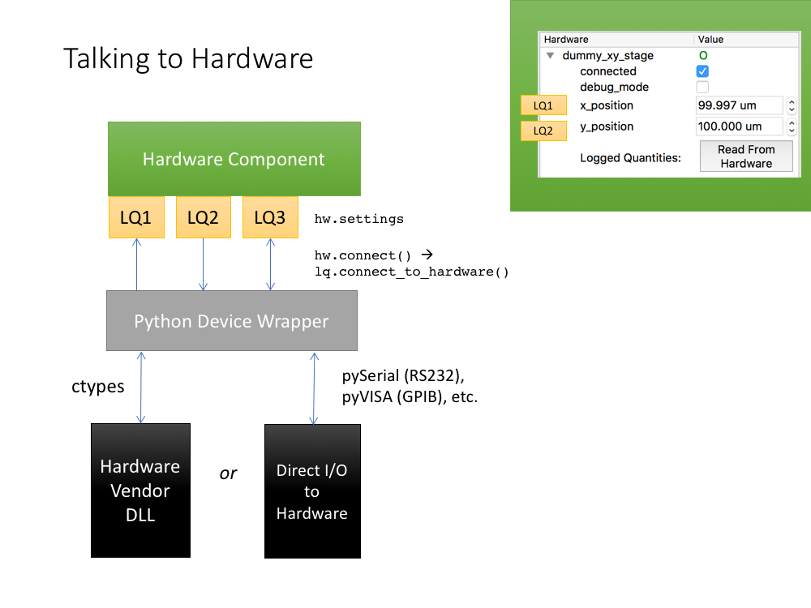

Here we discuss how to build a custom hardware plug-in for ScopeFoundry. If one is not available in our list of plug-ins, you can build one based on this tutorial. We will do this through 3 sections: First make a low-level python interface to the device, second write a ScopeFoundry `HardwareComponent`, and finally package up the result to share with the ScopeFoundry project and other users.



## Low-level device interface

Most scientific devices have programmatic ways to communicate to them, either through a vendor-povided API that talks to a device driver, or a communications protocol for a device connected by a standard communication pathway (RS232 serial, Ethernet, modbus etc)

The manufacturer often provides the commands needed for the computer to talk with your hardware. You should find your device's communication protocol within the provided manufacturer documentation, hopefully reverse engineering a communication protocol is not required!


The first step to controlling a device with ScopeFoundry is to create a convienient Python wrapper for the device, if one does not yet exist. We do this by wrapping the hardware functionality that we require in to a python object class. This low-level code is not dependent on ScopeFoundry, and is not required for building a hardware plugin, but illustrates good encapsulation of hardware functionality into a python object.

```python
import numpy as np
import time

class RandomNumberGenDev(object):
    """
    This is the low level dummy device object.
    Typically when instantiated it will connect to the real-world
    Methods allow for device read and write functions
    """
        
    def __init__(self, amplitude=1.0):
        """We would connect to the real-world here
        if this were a real device
        """
        self.write_amp(amplitude)
    
    def write_amp(self, amplitude):
        """
        A write function to change the device's amplitude
        normally this would talk to the real-world to change
        a setting on the device
        """
        self._amplitude = amplitude
            
    def read_rand_num(self):
        """
        Read function to access a Random number generator. 
        Acts as our scientific device picking up a lot of noise.
        """
        rand_data = np.random.ranf() * self._amplitude
        return rand_data
    
    def read_sine_wave(self):
        """
        Read function to access a sine wave.
        Acts like the device is generating a 1Hz sine wave
        with an amplitude set by write_amp
        """
        sine_data = np.sin(time.time()) * self._amplitude
        return sine_data
```

When we create an instance of this device class, we begin communication to the device. Other methods with names starting with `read_` or `write_` are the messages we can pass back and forth to the device.

In this case we defined a method `read_rand_num` which uses a random number generator from numpy and returns a random value every time it's called. This function is referenced in the hardware plugin section below code.

In the case where you would like to connect to real scientific equipment and define basic functions based on its communication protocol, I would recommend the following:

- Define whichever addresses and ports you would like to use using variables defined in the module's `__init__()` method.
- Then define a write function which can send messages to the device over RS232, Ethernet, via DLL or other protocol as required.


## Hardware Plug-in

The next step is to create the `HardwareComponent` ScopeFoundry plug-in. Here we sub-class `HardwareComponent` and define three methods: `setup()`, `connect()`, and `disconnect()`: 

```python
from ScopeFoundry import HardwareComponent
# import our low level device object class (previous section)
from ScopeFoundryHW.random_gen import RandomNumberGenDev


class RandomNumberGenHW(HardwareComponent):
    
    ## Define name of this hardware plug-in
    name = 'random_gen'
    
    def setup(self):
        # Define your hardware settings here.
        # These settings will be displayed in the GUI and auto-saved with data files
        self.settings.New(name='amplitude', initial=1.0, dtype=float, ro=False)
        self.settings.New(name='rand_data', initial=0, dtype=float, ro=True)
        self.settings.New(name="sine_data", initial=0, dtype=float, ro=True)
    
    def connect(self):
        # Open connection to the device:
        self.randgen_dev = RandomNumberGenDev(amplitude=self.settings['amplitude'])
        
        # Connect settings to hardware:
        self.settings.amplitude.connect_to_hardware(
            write_func = self.randgen_dev.write_amp)
        self.settings.rand_data.connect_to_hardware(
            read_func  = self.randgen_dev.read_rand_num)
        self.settings.sine_data.connect_to_hardware(
            read_func  = self.randgen_dev.read_sine_wave)
        
        #Take an initial sample of the data.
        self.read_from_hardware()
        
    def disconnect(self):
        # remove all hardware connections to settings
        self.settings.disconnect_all_from_hardware()
        
        # Don't just stare at it, clean up your objects when you're done!
        if hasattr(self, 'randgen_dev'):
            del self.randgen_dev

```

There are several critical components contained within this module which essentially handle signals, settings, and links to low level device functions. 

For the sake of simplicity we've omitted hardware level signals in this basic tutorial.

- `class`: We make our module a _subclass_ of `HardwareComponent`.
	- `setup()`
		- Here we set up a few settings for this hardware, these settings are `LoggedQuantity` objects that contain a hardware value that can read or written. This object helps keep this value in sync between hardware, measurement and graphical interface.

	- `connect()`
		- We define an object `self.randgendev` which instantiates the low-level device wrapper and thereby accesses hardware functions.
		- Using `connect_to_hardware()` we   to the device level `self.randgendev.rand_func`. Every time the we call `rand_data.read_from_hardware()` is called, the linked functions will be called.
		- We run `self.read_from_hardware()` to update all hardware-connected settings with initial readout values.

	- `disconnect()`
		- We clean up the mess we made by removing objects after use.

By having the `connect()` and `disconnect()`  we can cleanly reconnect hardware during an App run. This is especially useful when debugging a hardware plug-in to a new device. 

## Packaging

If you would like to include your shiny new plugin as a ScopeFoundryHW plug-in, ie sharing the ScopeFoundryHW package name and hosting it on github.com/scopefoundry. Here are some tips:

Use the example plug-in [`HW_random_gen`](https://github.com/scopefoundry/HW_random_gen/) as an example. It includes a README.md, LICENSE, and setup.py files required to make a plug-in package.

**Mapping of module name to github repo name:** 

* Python package name `ScopeFoundryHW.hw_plugin_name`
* Repo Location `https://github.com/ScopeFoundry/HW_hw_plugin_name`

The `setup.py` tells `pip` how to install your plug-in, along with meta-data about the plug-in. Here is the setup.py from HW\_random\_gen:

```python
from setuptools import setup

setup(
    name = 'ScopeFoundryHW.random_gen',
    
    version = '0.0.1',
    
    description = 'ScopeFoundry Hardware plug-in: Dummy random number generator',
    
    # Author details
    author='Edward S. Barnard',
    author_email='esbarnard@lbl.gov',

    # Choose your license
    license='BSD',

    package_dir={'ScopeFoundryHW.random_gen': '.'},
    
    packages=['ScopeFoundryHW.random_gen',],
    
    #packages=find_packages('.', exclude=['contrib', 'docs', 'tests']),
    #include_package_data=True,  
    
    package_data={
        '':["*.ui"], # include QT ui files 
        '':["README*", 'LICENSE'], # include License and readme 
        },
    )
```

If you would like to contribute a plug-in to ScopeFoundry, please do! Contact the maintainers on our [project mailing list](https://groups.google.com/forum/#!forum/scopefoundry).


## Where to Find Out More

This tutorial code is available in the [HW\_random\_gen](https://github.com/scopefoundry/HW_random_gen/) repository.

For questions about this tutorial or ScopeFoundry in general, please visit and post on the ScopeFoundry [project mailing list and forum](https://groups.google.com/forum/#!forum/scopefoundry).

For source code of all ScopeFoundry projects visit our [GitHub page](https://github.com/scopefoundry/).

